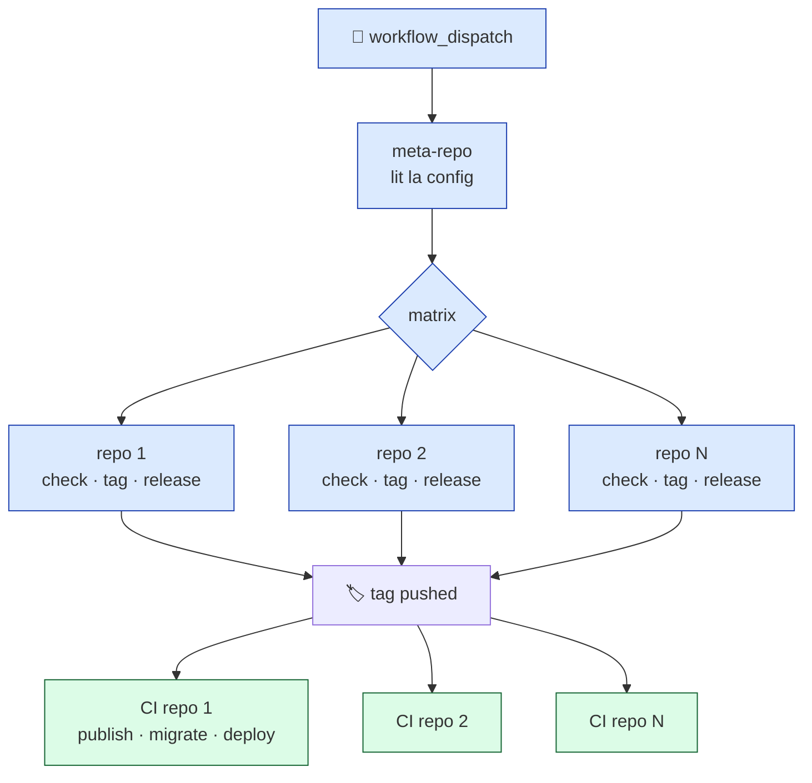

<style>
#slidev-goto-dialog {
  display: none !important;
}
.mermaid {
  text-align: center;
}
.slidev-layout.default h1 {
  font-size: 1.75rem;
  font-weight: 700;
  line-height: 1.25;
  margin-bottom: 0;
}
.slidev-layout.default footer p {
  margin: 0;
}
.compact-code pre,
.compact-code code {
  font-size: 0.72rem !important;
  line-height: 1.35 !important;
}
.tight-code pre,
.tight-code code {
  font-size: 0.78rem !important;
  line-height: 1.4 !important;
}
.slide-tight-top.slidev-page,
.slidev-page.slide-tight-top {
  padding-top: 1rem !important;
  padding-bottom: 0.5rem !important;
}
.slide-tight-top h1 {
  margin-top: -0.5rem !important;
}
</style>

---
layout: cover
---

# Automatiser les MEPs

<div class="text-2xl text-gray-400 font-light mt-2">Avec GitHub Actions et <code>repoflow</code></div>

<div class="absolute bottom-14 left-16 flex items-center gap-4 text-gray-500">

<span class="font-medium text-gray-700">Axel Mathieu-Le Gall</span> · Senior Fullstack Developer · Wealthcome
</div>

---

<!-- SLIDE 2 : HOOK -->

<div class="h-full flex flex-col justify-center items-center text-center px-20">

<div class="text-sm uppercase tracking-widest text-gray-400 mb-8">1 mois après la bascule</div>

<div v-click class="mb-10">
  <p class="text-6xl font-light tracking-tight">×4</p>
  <p class="text-lg text-gray-500 font-light mt-2">MEPs prod / semaine</p>
</div>

<div v-click class="mb-10">
  <p class="text-6xl font-light tracking-tight">100%</p>
  <p class="text-lg text-gray-500 font-light mt-2">de succès en prod (vs 70% avant)</p>
</div>

<div v-click>
  <p class="text-6xl font-light tracking-tight">1 dev · 2 clics</p>
  <p class="text-lg text-gray-500 font-light mt-2">vs 3 personnes · 45 minutes</p>
</div>

</div>

<!--
Phase 1 (0-5s) — Silence d'entrée.
Phase 2 (5-15s) — "×4 plus souvent en prod."
Phase 3 (15-25s) — "100% de succès. Sur backend on était à 54% avant."
Phase 4 (25-35s) — "1 dev, 2 clics. Avant c'était 3 personnes, 45 minutes."
Phase 5 — "Je m'appelle Axel, et en 30 minutes je vais vous raconter comment."
-->

---

# Wealthcome : 5 repos, 1 équipe

<div class="grid grid-cols-5 gap-1 mt-4">

<div class="border rounded-lg p-2 text-center">
  <div class="text-xl mb-1">🎨</div>
  <div class="font-semibold text-xs">web</div>
  <div class="text-[10px] text-gray-500">Front B2C · React/TS</div>
</div>

<div class="border rounded-lg p-2 text-center">
  <div class="text-xl mb-1">🎨</div>
  <div class="font-semibold text-xs">cgp-platform</div>
  <div class="text-[10px] text-gray-500">Front B2B · React/TS</div>
</div>

<div class="border rounded-lg p-2 text-center">
  <div class="text-xl mb-1">⚙️</div>
  <div class="font-semibold text-xs">backend</div>
  <div class="text-[10px] text-gray-500">API · Nest/TS</div>
</div>

<div class="border rounded-lg p-2 text-center">
  <div class="text-xl mb-1">⚡</div>
  <div class="font-semibold text-xs">aggregated</div>
  <div class="text-[10px] text-gray-500">Nouvelle API · Hono/TS</div>
</div>

<div class="border rounded-lg p-2 text-center">
  <div class="text-xl mb-1">🗄️</div>
  <div class="font-semibold text-xs">shared-aggregations</div>
  <div class="text-[10px] text-gray-500">Migrations DB</div>
</div>

</div>

<div class="text-gray-600 italic text-sm mt-6 mb-3">Le coût d'une MEP cross-app :</div>

- 🐌 Orchestrer 5 repos à la main, dans le bon ordre
- 🔀 Taguer, releaser, notifier = 5× le même process manuel
- 📋 Savoir ce qui part en prod = checker 5 GitHub, recopier à la main

<!--
Oral (1m) :
- "5 repos, 1 équipe de 8 devs. Fintech bordelaise."
- "À 5 repos, ce qui coûtait 10 minutes à 1 repo devient 1 heure à tout le monde."
-->

---

# Les 3 questions qu'on se posait toutes les semaines

<div class="space-y-6 mt-6">

<div class="border-l-4 border-red-400 pl-6">

🔀 **"Est-ce que j'ai bien pris tous les hotfix ?"**

<span class="text-sm text-gray-500">Conflits ? Fix oublié d'un·e collègue ?</span>

</div>

<div class="border-l-4 border-amber-400 pl-6">

📢 **"C'est quoi qui part en prod ce soir ?"**

<span class="text-sm text-gray-500">Changelog = titres de commits. Pas de nomenclature.</span>

</div>

<div class="border-l-4 border-blue-400 pl-6">

🕰️ **"Ça a été déployé quand, exactement ?"**

<span class="text-sm text-gray-500">Rythmes irréguliers. On déployait "quand on pouvait".</span>

</div>

</div>

<!--
Oral (1m) :
- "3 questions qu'on se posait à chaque MEP."
- "Hotfix perdu. Communication en chinois. Zéro prévisibilité."

PÉPITE : "À force de vivre avec la douleur, on finit par ne plus la voir."
-->

---

# Les fondations avant l'automatisation

<div class="text-gray-500 italic mt-2 mb-6">
L'automatisation sans fondations amplifie le chaos.
</div>

**✅ Un flow Git simple**

<span class="text-gray-500 text-sm ml-8">GitHub Flow — `main` stable + branches `feat/*`, `fix/*`.</span>

<div class="mt-5"></div>

**✅ Des environnements dédiés et étanches**

<span class="text-gray-500 text-sm ml-8">`dev` → `staging` → `preprod` → `prod`</span>

<div class="mt-5"></div>

**✅ Une CI qui bloque avant le merge**

<span class="text-gray-500 text-sm ml-8">Tests, lint, build reproductibles, nomenclature PR forcée</span>

<div class="mt-8 text-center text-sm text-gray-500 italic">
Pas négociable. Rien de ce qui suit ne marche sans ça.
</div>

<!--
Oral (45s) :
- "Ces 3 éléments sont des pré-requis, pas des plus."
- "Sans eux, automatiser = accélérer la production de bugs."
-->

---

# Pourquoi un meta-repository ?

<div class="grid grid-cols-2 gap-8 mt-6">

<div class="border rounded-lg p-5 bg-gray-50">

<div class="text-sm font-semibold uppercase tracking-wider text-gray-600 mb-3">
❌ Option monorepo
</div>

- Refonte complète de la CI/CD
- Migration risquée
- Outillage à repenser
- "Big bang" difficile à planifier

<div class="text-xs text-gray-500 mt-3 italic">
L'équipe n'a pas besoin d'un nouveau projet à apprendre.
</div>

</div>

<div class="border rounded-lg p-5 bg-blue-50 border-blue-200">

<div class="text-sm font-semibold uppercase tracking-wider text-blue-700 mb-3">
✅ Option meta-repository
</div>

- Les repos existants ne bougent pas
- Une couche d'orchestration en plus
- Transition **douce**, progressive
- Chaque repo garde sa **souveraineté**

<div class="text-xs text-gray-500 mt-3 italic">
On ajoute, on ne remplace pas.
</div>

</div>

</div>

<div class="mt-8 text-center text-lg italic text-gray-600 border-t pt-4">
Pas de refonte d'architecture. Juste une couche d'orchestration.
</div>

<!--
Oral (1m30) :
- "Premier arbitrage : monorepo ?"
- "Réponse : non. Trop coûteux, trop risqué."
- "À la place : un meta-repo qui orchestre les repos existants."

TRANSITION :
"Maintenant, parlons de l'outil qui va nous servir à construire ça : GitHub Actions."
-->

---
layout: section
---

<div class="text-center">

<div class="text-sm uppercase tracking-widest text-gray-400 mb-4">Partie 2</div>

<div class="text-5xl font-light">
GitHub Actions, les briques utiles
</div>

<div class="text-lg text-gray-500 italic mt-6">
5 minutes pour poser le vocabulaire.
</div>

</div>

<!--
Oral (15s) :
- "Courte parenthèse avant de montrer notre implémentation."
- "Je veux m'assurer qu'on parle le même langage."
-->

---

# GitHub Actions en 30 secondes

<div class="grid grid-cols-2 gap-8 mt-4">

<div>

**L'idée**

Automatiser des tâches en réponse à des événements GitHub (push, PR, tag, cron...).

Les workflows sont du **YAML** dans `.github/workflows/` — versionné avec le code.

**Ce qu'on peut y faire**

- Tester, builder, déployer
- Créer des releases, poster sur Slack
- Ouvrir des issues, commenter des PRs
- Tout ce qui a une API

</div>

<div>

**Pourquoi c'est bien**

- ✅ Intégré à GitHub, zéro setup
- ✅ Free pour l'open-source, généreux pour le privé
- ✅ **20 000+ actions** publiques réutilisables
- ✅ Support self-hosted si besoin

**Les alternatives**

<span class="text-sm text-gray-500">GitLab CI · CircleCI · Jenkins · Buildkite · Drone</span>

<div class="text-xs text-gray-500 mt-2 italic">
Le pattern qu'on va voir se transpose sur toutes.
</div>

</div>

</div>

<!--
Oral (45s) :
- "GitHub Actions : du YAML dans .github/workflows, déclenché par des événements."
- "20 000+ actions publiques dans le marketplace."
- "Le pattern qu'on va voir se transpose sur d'autres CI."

PÉPITE : "Le YAML versionné avec le code, c'est la vraie killer feature. Pas de config externe qui dérive."
-->

---

# La syntaxe en 20 lignes

```yaml {all|1-3|5-6|8-9|11-20}
name: Hello World
on:
  push: { branches: [main] }

jobs:                              # ← une unité d'exécution
  test:                            # ← le nom du job

    runs-on: ubuntu-latest         # ← la machine
    timeout-minutes: 10

    steps:                         # ← les étapes, séquentielles
      - uses: actions/checkout@v4  # ← action publique
      - uses: actions/setup-node@v4
        with:
          node-version: 20

      - name: Install
        run: pnpm install          # ← commande shell

      - name: Test
        run: pnpm test
```

<div class="text-xs text-gray-500 mt-2 text-center">
🟦 <code>workflow</code> · 🟩 <code>jobs</code> · 🟨 <code>steps</code>
</div>

<!--
Oral (1m30) — révélation progressive :
- (1) Workflow : name + on (les déclencheurs)
- (2) Jobs : unités parallélisables
- (3) Steps : séquentiels dans un job
- "Le marketplace : `uses:` pour importer une action publique. `run:` pour du shell brut."

PÉPITE : "Ce YAML, c'est déjà 80% de ce que font la plupart des pipelines."
-->

---

# 3 briques qui font la différence · (1/2)

<div class="grid grid-cols-2 gap-6 mt-4">

<div>

<div class="text-xs font-semibold uppercase tracking-wider text-blue-700 mb-3">🎯 Matrix</div>

Paralléliser le même job sur plusieurs variantes.

```yaml
jobs:
  test:
    strategy:
      matrix:
        node: [18, 20, 22]
        os: [ubuntu, macos]
    runs-on: ${{ matrix.os }}-latest
    steps:
      - uses: actions/setup-node@v4
        with:
          node-version: ${{ matrix.node }}
```

<div class="text-xs text-gray-500 mt-3">
→ 6 jobs lancés en parallèle
</div>

</div>

<div>

<div class="text-xs font-semibold uppercase tracking-wider text-green-700 mb-3">📦 Composite actions</div>

Factoriser des steps réutilisables.

```yaml
# .github/actions/setup/action.yml
runs:
  using: composite
  steps:
    - uses: pnpm/action-setup@v4
    - uses: actions/setup-node@v4
      with: { node-version: 20, cache: pnpm }
    - run: pnpm install --frozen-lockfile
      shell: bash
```

```yaml
# Dans un workflow :
- uses: ./.github/actions/setup
```

<div class="text-xs text-gray-500 mt-3">
→ DRY à travers N workflows
</div>

</div>

</div>

<!--
Oral (1m30) :
- "Matrix : le même job sur N variantes en parallèle."
- "Composite actions : factoriser 3-4 steps répétés dans un sous-dossier."
- "Chez Wealthcome, on a une action `setup` comme celle-ci, dans tous nos workflows."

PÉPITE : "Composite actions = les fonctions de la CI."
-->

---

# 3 briques qui font la différence · (2/2)

<div class="grid grid-cols-2 gap-6 mt-4">

<div>

<div class="text-xs font-semibold uppercase tracking-wider text-purple-700 mb-3">🔁 Reusable workflows</div>

Comme les composite actions, mais à l'échelle **workflow entier**.

<div class="compact-code">

```yaml
# repo: org/ci-workflows
name: Deploy
on:
  workflow_call:
    inputs:
      env: { type: string, required: true }
    secrets:
      TOKEN: { required: true }
jobs:
  deploy: ...
```

```yaml
# Dans un autre repo :
uses: org/ci-workflows/.github/workflows/deploy.yml@v1
```

</div>

</div>

<div>

<div class="text-xs font-semibold uppercase tracking-wider text-amber-700 mb-3">🚦 Concurrency</div>

Éviter que 2 runs se marchent dessus.

```yaml
concurrency:
  group: deploy-prod-${{ github.ref }}
  cancel-in-progress: false
```

<div class="text-sm text-gray-600 mt-4">

Si un 2e run arrive pendant qu'un 1er tourne :
- `cancel-in-progress: true` → on tue le 1er
- `cancel-in-progress: false` → on queue le 2e

<div class="text-xs text-gray-500 mt-2 italic">
Pour les déploiements : toujours <code>false</code>.
</div>

</div>

</div>

</div>

<!--
Oral (1m30) :
- "Reusable workflows : un cran au-dessus. Un workflow complet, partagé entre repos."
- "Parfait pour standardiser : 'tous les repos déploient avec CE workflow'."
- "Concurrency : quand 2 MEPs tombent en 10s, GitHub les sérialise ou les tue."
- "Pour un déploiement : toujours false. Sinon : 2 containers qui se marchent dessus."

PÉPITE : "Concurrency, c'est le détail oublié qui cause 90% des déploiements corrompus."
-->

---

# La brique qu'on oublie : self-hosted runners

<div class="grid grid-cols-2 gap-8 mt-3">

<div>

**Pourquoi ?**

- 🚀 **Cache Docker partagé** · builds 6min → 90s
- 🔒 **Réseau interne direct** · zéro config VPN
- 💰 **Coût** · break-even ~40–50k min/mois
- 🎯 **Contrôle** · version Node, outils custom

</div>

<div>

**Setup**

```yaml
jobs:
  deploy:
    runs-on: self-hosted
    # ou avec labels :
    runs-on: [self-hosted, linux, eks]
```

</div>

</div>

<div class="mt-4 border rounded-lg p-3 bg-gray-50">

<div class="text-xs uppercase tracking-wider text-gray-600 mb-2">💵 Facturation GitHub Actions · l'essentiel</div>

<div class="grid grid-cols-3 gap-4 text-xs">

<div>

**Tarif runner (privé)**

- Linux · `$0.008/min` (×1)
- Windows · `$0.016/min` (×2)
- macOS · `$0.08/min` (×10)

</div>

<div>

**Quota gratuit / mois**

- Free · 2 000 min
- Team · 3 000 min
- Enterprise · 50 000 min

</div>

<div>

**Self-hosted**

- 0 $ côté GitHub
- Tu payes ton infra (EC2, K8s…)
- Formule : `min × mult × $0.008 > coût node`

</div>

</div>

</div>

<div class="mt-3 bg-amber-50 border-l-4 border-amber-400 p-2 text-xs">

⚠️ **Contre-indications** : équipe < 10 devs, pas d'infra K8s existante, volume CI < 50 runs/jour. Restez sur les runners GitHub — le self-hosted a un coût d'ops non-trivial.

</div>

<!--
Oral (1m) :
- "Self-hosted : tentant mais pas toujours justifié."
- "Chez nous : cache Docker partagé (6min → 90s), réseau direct aux clusters."
- "MAIS : si vous êtes 5 devs, gardez les runners GitHub."

PÉPITE : "Le self-hosted n'est pas une optimisation prématurée. C'est une optimisation qui se gagne."
-->

---
layout: section
---

<div class="text-center">

<div class="text-sm uppercase tracking-widest text-gray-400 mb-4">Partie 3</div>

<div class="text-5xl font-light">
Notre implémentation
</div>

<div class="text-lg text-gray-500 italic mt-6">
Comment on a assemblé les briques.
</div>

</div>

<!--
Oral (15s) :
- "Voilà les briques. Maintenant, comment on les a assemblées chez Wealthcome."
-->

---

# Le pattern en 2 niveaux

<div class="text-sm text-gray-500 mb-4">La décision architecturale clé — transposable partout.</div>



<div class="mt-4 grid grid-cols-2 gap-6 text-sm">

<div class="border-l-2 border-blue-400 pl-4">

**Niveau 1 — Le meta**

Orchestration pure : lit la config, crée les tags.
<br/><span class="text-gray-500 text-xs">Ne sait RIEN du déploiement.</span>

</div>

<div class="border-l-2 border-green-600 pl-4">

**Niveau 2 — Chaque repo**

Pipeline métier : publish, migrate, deploy, notify.
<br/><span class="text-gray-500 text-xs">Souveraineté complète.</span>

</div>

</div>

<!--
Oral (1m30) :
- "Le meta ne connaît PAS les détails de déploiement. Il crée des tags."
- "Chaque repo a son propre flow qui réagit au push de tag."
- "Le couplage se fait par le tag — interface universelle en Git."
- "Conséquence : on peut ajouter un 6e repo demain, le meta n'a qu'à le lister."

PÉPITE : "Un bon système, c'est un système où chaque brique fait UNE chose — et la fait bien."
-->

---
class: 'slide-tight-top'
---

# Un workflow concret

<div class="text-xs text-gray-500 mb-2">Workflow de pre-release — <code>.github/workflows/prerelease.yml</code> (simplifié)</div>

<div class="compact-code">

```yaml {all|1-4|6-8|10-12|14-20|22-24}
on:
  schedule: [{ cron: '20 5 * * 1-5' }]  # 7h20 Paris, jours ouvrés
  workflow_dispatch:
    inputs: { repos: { default: 'all' } }

concurrency:                   # ← pas 2 releases en parallèle
  group: release-staging
  cancel-in-progress: false

jobs:
  prepare:                     # ← lit la config, construit la matrix
    steps: [{ run: pnpm repoflow list --json }]

  release:                     # ← 1 job par repo (matrix)
    needs: prepare
    strategy:
      matrix: ${{ fromJson(needs.prepare.outputs.matrix) }}
      fail-fast: false
    steps:
      - uses: ./.github/actions/release-flow
        with: { type: prerelease, repo: ${{ matrix.repo.name }} }

  changelog:                   # ← 1 message Slack agrégé à la fin
    needs: release
    steps: [{ run: pnpm changelog:prerelease }]
```

</div>

<!--
Oral (2m) — révélation progressive :
- (1) Déclencheurs : cron quotidien + bouton manuel.
- (2) Concurrency : un seul run à la fois.
- (3) Prepare : lit la config, construit la matrix.
- (4) Release : 1 job par repo via matrix, utilise une composite action.
- (5) Changelog : message agrégé à la fin.
- "Matrix, composite action, concurrency : les 3 briques qu'on vient de voir."

PÉPITE : "Ce workflow fait 30 lignes. Avant on avait 300 lignes, copiées dans 5 repos."
-->

---

# Le changement de process

<div class="grid grid-cols-2 gap-6 mt-6">

<div class="border rounded-lg p-4 bg-gray-50">

<div class="text-xs uppercase tracking-wider text-gray-600 mb-2">Avant</div>

- 🕰️ Préprod "quand on peut"
- 📢 Prod à la demande, ad hoc
- 🙋 Pas de responsable clair
- 📋 Changelog = titres de commits

</div>

<div class="border rounded-lg p-4 bg-blue-50 border-blue-200">

<div class="text-xs uppercase tracking-wider text-blue-700 mb-2">Après</div>

- 🌅 Préprod auto tous les matins (7h20)
- 🚀 Prod mardi & jeudi soir
- 🎓 **Rôle tournant** (responsable du jour)
- 📦 Changelog enrichi via Notion

</div>

</div>

<div class="mt-6 bg-amber-50 border-l-4 border-amber-400 p-3 text-sm">

🎯 **Le rôle tournant** : chaque lead porte le process à tour de rôle. Il se forge son avis, devient ambassadeur. C'est la brique humaine qui a le plus compté.

</div>

<div class="mt-4 text-center text-sm text-gray-500 italic">
Pas que de la tech. Un process, c'est d'abord des gens.
</div>

<!--
Oral (1m30) :
- "La technique seule ne suffit pas. On a aussi changé le process."
- "Rythme fixe : préprod auto le matin, prod mardi/jeudi soir. Tout le monde sait."
- "Responsable du jour : rôle tournant entre les leads."
- "Changelog enrichi via Notion : les tickets remontent avec les titres, pas les SHA."

PÉPITE : "Un rôle tournant, c'est la meilleure défense contre le bus factor."
-->

---

# La leçon qu'on oublie souvent

<div class="mt-8 space-y-5">

<div class="bg-red-50 border-l-4 border-red-400 p-4">

<div class="uppercase tracking-wider text-xs text-red-500 mb-1">Le problème</div>

Au démarrage, des bugs : tag qui pointe trop loin, release embarquant des commits non prêts.<br/>
Les leads se braquent : *"On te l'avait dit."*

</div>

<div class="bg-amber-50 border-l-4 border-amber-400 p-4">

<div class="uppercase tracking-wider text-xs text-amber-700 mb-1">Le coût réel</div>

La technique, on l'a corrigée en quelques jours.<br/>
**Regagner la confiance des leads a pris des mois.**

</div>

<div class="bg-green-50 border-l-4 border-green-500 p-4">

<div class="uppercase tracking-wider text-xs text-green-700 mb-1">Ce qu'on a fait</div>

Présentations tech + produit · réunions d'itération avec les leads · **rôle tournant** sur le process.

</div>

</div>

<div class="mt-6 text-center text-lg italic text-gray-600 border-t pt-4">
Automatiser un process, ce n'est pas le déléguer. C'est le partager.
</div>

<!--
Oral (1m30) :
- "Une leçon apprise à la dure."
- "Les bugs du début ont braqué les leads."
- "Ce que j'ai mal fait : construire un outil sans construire un savoir partagé."
- "Automatiser un process, ce n'est pas le déléguer à une machine. C'est le partager avec l'équipe."
-->

---

# 1 mois plus tard

<div class="grid grid-cols-3 gap-6 mt-10">

<div class="text-center">

<div class="text-5xl font-light tracking-tight">×4</div>

<div class="text-sm uppercase tracking-wider text-gray-500 mt-3">MEPs prod / semaine</div>

</div>

<div class="text-center">

<div class="text-5xl font-light tracking-tight">100%</div>

<div class="text-sm uppercase tracking-wider text-gray-500 mt-3">succès pipelines prod</div>

</div>

<div class="text-center">

<div class="text-5xl font-light tracking-tight">-30%</div>

<div class="text-sm uppercase tracking-wider text-gray-500 mt-3">durée des pipelines</div>

</div>

</div>

<div class="mt-12 text-center text-2xl font-light">
Plus souvent. Plus fiable. Plus vite.
</div>

<div class="mt-2 text-center text-base text-gray-500 italic">
Et ça ne mobilise plus qu'1 développeur, en 2 clics.
</div>

<!--
Oral (45s) :
- "3 chiffres. Volume, fiabilité, vitesse."
- "Fréquence prod ×4 — 1.3 → 5.7 MEPs/semaine."
- "100% de succès sur backend. Avant, on était à 54%."
- "Pipelines -30%. Alors qu'on a ajouté des étapes au passage."

PÉPITE : "Les personnes les plus sceptiques au début sont celles qui s'inquiètent aujourd'hui si le pipeline a 5 min de retard."
-->

---

# Ce que l'équipe en dit

<TestimonyCarousel />

<!--
Oral (1m) :
- "Les chiffres, c'est une chose. Ce qui me rend fier, c'est d'entendre l'équipe."
- "Elle parle de charge mentale."

PÉPITE : "L'automatisation réussie, c'est celle qui rend le travail des autres plus léger."
-->

---
layout: section
---

<div class="text-center">

<div class="text-sm uppercase tracking-widest text-gray-400 mb-4">Partie 4</div>

<div class="text-5xl font-light">
Démo & ressources
</div>

<div class="text-lg text-gray-500 italic mt-6">
Le code du talk, littéralement.
</div>

</div>

<!--
Oral (10s) :
- "Passons à la partie concrète. Ce que vous pouvez emporter avec vous."
-->

---

# `@axelmth/repoflow` — le package

<div class="text-center text-lg text-gray-600 italic mt-4 mb-8">
Orchestrer des meta-repositories, en ligne de commande.
</div>

<div class="grid grid-cols-3 gap-6">

<div class="border rounded-lg p-6">

<div class="text-3xl mb-2">🏗️</div>

**Bootstrap**

<span class="text-sm text-gray-600">`repoflow init` — wizard interactif, 2 minutes.</span>

</div>

<div class="border rounded-lg p-6">

<div class="text-3xl mb-2">🔁</div>

**Orchestration**

<span class="text-sm text-gray-600">`sync`, `status`, `exec`, `doctor` — N repos d'un coup.</span>

</div>

<div class="border rounded-lg p-6 bg-amber-50 border-amber-200">

<div class="text-3xl mb-2">🚀</div>

**Release flow**

<span class="text-sm text-gray-600">Tagging RC/prod, changelog, Slack — *v0.2 en cours*</span>

</div>

</div>

<div class="mt-8 bg-gray-50 border rounded-lg p-4 text-sm text-center">

```bash
npm i -g @axelmth/repoflow
```

</div>

<!--
Oral (45s) :
- "Le pkg est sur npm. v0.1.0, pre-alpha."
- "2 piliers prêts : bootstrap et orchestration."
- "Release flow complet arrive en v0.2."

PÉPITE : "Hommage à Mateo del Norte. Package meta de 2015, plus maintenu. Cette fois on continue."
-->

::footer::

<div class="flex items-center justify-center gap-8 text-xs">
<code class="bg-gray-100 px-2 py-1 rounded">npmjs.com/package/@axelmth/repoflow</code>
<span class="text-gray-500">🔗 github.com/AxelMth/repoflow</span>
</div>

---

# `repoflow-metarepo-example` — le template

<div class="text-sm text-gray-500 mb-6">
🔗 github.com/AxelMth/repoflow-metarepo-example
</div>

<div class="grid grid-cols-2 gap-6">

<div class="border rounded-lg p-5">

<div class="text-xs uppercase tracking-wider text-gray-600 mb-3">Ce qu'il contient</div>

- `repoflow.config.ts` prêt à l'emploi
- 3 workflows GitHub Actions :
  - `prerelease.yml`
  - `release.yml`
  - `hotfix-prod.yml` + `hotfix-preprod.yml`
- Actions composites : `create-tag`, `notify-slack`
- README avec setup step-by-step

</div>

<div class="border rounded-lg p-5 bg-blue-50">

<div class="text-xs uppercase tracking-wider text-blue-700 mb-3">Comment l'utiliser</div>

<div class="tight-code">

```bash
# Clone + install
git clone github.com/AxelMth/repoflow-metarepo-example
cd repoflow-metarepo-example && pnpm install

# Configurer puis lancer
$EDITOR repoflow.config.ts
pnpm sync
```

</div>

</div>

</div>

<!--
Oral (1m) :
- "Pour que ce soit vraiment reproductible : un repo modèle."
- "Vous clonez, vous configurez, vous êtes à peu près là où on est chez Wealthcome."
-->

::footer::

_💡 Clonez, forkez, testez. Les issues sont ouvertes._

---

# Démo live

<div class="h-full flex flex-col items-center justify-center gap-8 -mt-6">

<div class="text-xl font-light text-gray-700 italic">
Et si je vous montrais ?
</div>

<div class="grid grid-cols-2 gap-6 w-full max-w-3xl">

<a href="https://github.com/AxelMth/repoflow-metarepo-example" target="_blank" class="border rounded-lg p-5 text-center hover:bg-blue-50 transition-colors no-underline text-gray-800">

<div class="text-3xl mb-2">📦</div>

**1 · repoflow en action**

<span class="text-sm text-gray-600">~1 min · sync · status · doctor</span>

</a>

<a href="https://github.com/wealthcome-SAS/wealthcome-meta/actions/workflows/prerelease.yml" target="_blank" class="border rounded-lg p-5 text-center hover:bg-green-50 transition-colors no-underline text-gray-800">

<div class="text-3xl mb-2">🚀</div>

**2 · Wealthcome CI live**

<span class="text-sm text-gray-600">~2 min · workflow en dry-run</span>

</a>

</div>

</div>

<!--
Oral (3 min total) :

[1 min repoflow]
- Ouvrir repoflow-metarepo-example sur GitHub
- Dans le terminal : pnpm sync
- Montrer les 3 repos clonés
- pnpm status → tableau avec branch/tag/dirty
- pnpm doctor → "tout est vert"

[2 min Wealthcome]
- Ouvrir l'onglet Actions de wealthcome-meta
- Cliquer sur prerelease → Run workflow
- Cocher "dry-run"
- Lancer
- Pendant que ça tourne, commenter l'interface
- Montrer le résultat : 3 tags simulés, pas de push réel

SI CA PLANTE :
- Lancer la vidéo pré-enregistrée (public/demo-backup.mp4)
- "Spoiler : ça marche. Regardez."

⚠️ TODO avant le talk :
- Enregistrer une vidéo de ~2-3 min de backup
- La mettre dans public/demo-backup.mp4
- Tester le wifi de la salle la veille
-->

---
layout: section
---

<div class="text-center">

<div class="text-sm uppercase tracking-widest text-gray-400 mb-4">Partie 5</div>

<div class="text-5xl font-light">
Questions
</div>

</div>

---

# Questions fréquentes anticipées

<div class="space-y-4 mt-4 text-sm">

<div class="border-l-4 border-blue-400 pl-4">

**❓ Pourquoi pas un monorepo ?**

Parce que c'est une bascule coûteuse. Meta-repo = option intermédiaire qui ne casse pas l'existant. Chaque équipe décide quand (ou jamais) elle passe en monorepo.

</div>

<div class="border-l-4 border-blue-400 pl-4">

**❓ Pourquoi pas `meta` de Mateo del Norte ?**

Plus maintenu depuis 2020. Stack 2026 = TypeScript + pnpm + GitHub Actions natifs. `repoflow` reprend la philosophie, modernise la stack.

</div>

<div class="border-l-4 border-blue-400 pl-4">

**❓ 100% de succès sur 21 jours, c'est significatif ?**

Non, c'est court. Mais comparé à 54% sur 90 jours avant, la tendance est franche. Prochaine version du talk : 3 mois de recul.

</div>

<div class="border-l-4 border-blue-400 pl-4">

**❓ 2 clics, pas 1 ?**

Le 2e clic, c'est le "Publish" sur la release en draft. Un filet humain volontaire. Feature, pas dette.

</div>

</div>

<!--
Ces Q&A sont à utiliser SI on me les pose. Sinon, passer directement à la slide suivante.

Philosophie : anticiper les objections = montrer qu'on a réfléchi.
-->

---
layout: center
---

<div class="text-center space-y-8">

<div class="text-sm uppercase tracking-widest text-gray-400">À vous</div>

<div class="text-5xl font-light">
Vos questions ?
</div>

<div class="text-lg text-gray-500 italic max-w-lg mx-auto">
Celles auxquelles je ne sais pas répondre,<br/>
je vous dis "je ne sais pas" — on en discute après.
</div>

</div>

<!--
Slide de respiration pour la Q&A.

Oral :
- "Toutes vos questions sont bienvenues."
- "Y compris celles qui remettent en question ce que je viens de dire."
-->

---
layout: center
class: text-center
---

# Merci

<div class="grid grid-cols-2 gap-12 max-w-3xl mx-auto items-center mt-12">

<div class="flex flex-col items-center">


<div class="mt-4 text-base text-gray-600 text-center w-56">
↑ Ton retour sur ce talk (2 min)
</div>

</div>

<div class="text-left">

<div class="flex items-center gap-5 mb-4">

<div>
<div class="text-xl font-semibold leading-snug">Axel Mathieu-Le Gall</div>
<div class="text-sm text-gray-500 mt-1">Senior Fullstack Developer · Wealthcome</div>
</div>
</div>

<div class="pt-4 space-y-2 text-base">

💼 linkedin.com/in/axel-mathieu-le-gall-361b1510a

💻 github.com/AxelMth

📦 npmjs.com/package/@axelmth/repoflow

🧪 github.com/AxelMth/repoflow-metarepo-example

</div>

</div>

</div>

<!--
Oral :
- "Grand merci à l'équipe Wealthcome, à BordeauxJS, à vous."
- "Cette slide reste pendant la Q&A. Le QR : feedback en 2 minutes."

⚠️ TODO : qr-feedback.svg
-->
