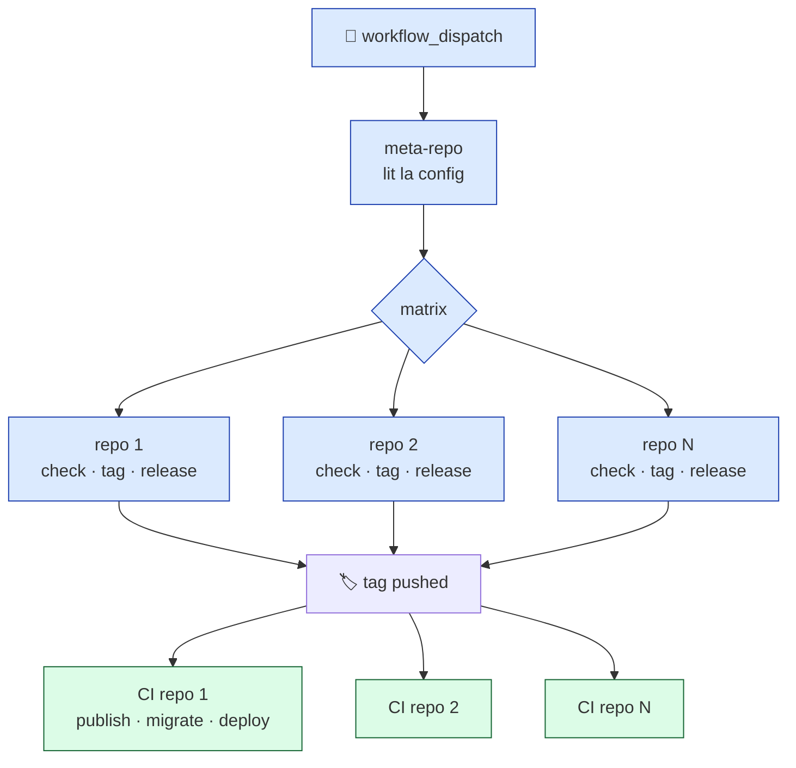

<style>
#slidev-goto-dialog {
  display: none !important;
}
.mermaid {
  text-align: center;
}
.slidev-layout.default h1 {
  font-size: 1.75rem;
  font-weight: 700;
  line-height: 1.25;
  margin-bottom: 0;
}
.slidev-layout.default footer p {
  margin: 0;
}
</style>

---
layout: cover
---

# Automatiser les MEPs

<div class="text-2xl text-gray-400 font-light mt-2">Avec GitHub Actions et <code>repoflow</code></div>

<div class="absolute bottom-14 left-16 flex items-center gap-4 text-gray-500">

<span class="font-medium text-gray-700">Axel Mathieu-Le Gall</span> · Senior Fullstack Developer · Wealthcome
</div>

---

<!-- SLIDE 2 : HOOK — Les chiffres directement -->

<div class="h-full flex flex-col justify-center items-center text-center px-20">

<div class="text-sm uppercase tracking-widest text-gray-400 mb-8">1 mois après la bascule</div>

<div v-click class="mb-10">
  <p class="text-6xl font-light tracking-tight">×4</p>
  <p class="text-lg text-gray-500 font-light mt-2">MEPs prod / semaine</p>
</div>

<div v-click class="mb-10">
  <p class="text-6xl font-light tracking-tight">100%</p>
  <p class="text-lg text-gray-500 font-light mt-2">de succès en prod (vs 70% avant)</p>
</div>

<div v-click>
  <p class="text-6xl font-light tracking-tight">1 dev · 2 clics</p>
  <p class="text-lg text-gray-500 font-light mt-2">vs 3 personnes · 45 minutes</p>
</div>

</div>

<!--
Phase 1 (0-5s) — Silence d'entrée.
Phase 2 (5-15s) — "×4 plus souvent en prod."
Phase 3 (15-25s) — "100% de succès. Sur backend on était à 54% avant."
Phase 4 (25-35s) — "1 dev, 2 clics. Avant c'était 3 personnes, 45 minutes."
Phase 5 — "Je m'appelle Axel, et en 30 minutes je vais vous raconter comment. Et surtout, comment vous pouvez faire pareil."

CLÉ : On annonce repoflow dès le titre. Le public sait qu'il y a un outil à la fin.
-->

---

# Wealthcome : 5 repos, 1 équipe

<div class="grid grid-cols-5 gap-1 mt-4">

<div class="border rounded-lg p-2 text-center">
  <div class="text-xl mb-1">🎨</div>
  <div class="font-semibold text-xs">web</div>
  <div class="text-[10px] text-gray-500">Front B2C · React/TS</div>
</div>

<div class="border rounded-lg p-2 text-center">
  <div class="text-xl mb-1">🎨</div>
  <div class="font-semibold text-xs">cgp-platform</div>
  <div class="text-[10px] text-gray-500">Front B2B · React/TS</div>
</div>

<div class="border rounded-lg p-2 text-center">
  <div class="text-xl mb-1">⚙️</div>
  <div class="font-semibold text-xs">backend</div>
  <div class="text-[10px] text-gray-500">API · Nest/TS</div>
</div>

<div class="border rounded-lg p-2 text-center">
  <div class="text-xl mb-1">⚡</div>
  <div class="font-semibold text-xs">aggregated</div>
  <div class="text-[10px] text-gray-500">Nouvelle API · Hono/TS</div>
</div>

<div class="border rounded-lg p-2 text-center">
  <div class="text-xl mb-1">🗄️</div>
  <div class="font-semibold text-xs">shared-aggregations</div>
  <div class="text-[10px] text-gray-500">Migrations DB</div>
</div>

</div>

<div class="text-gray-600 italic text-sm mt-6 mb-3">Le coût d'une MEP cross-app :</div>

- 🐌 Orchestrer 5 repos à la main, dans le bon ordre
- 🔀 Taguer, releaser, notifier = 5× le même process manuel
- 📋 Savoir ce qui part en prod = checker 5 GitHub, recopier à la main

<!--
Oral (1m) :
- "5 repos, 1 équipe de 8 devs."
- "CGP = Conseiller en Gestion de Patrimoine. Fintech bordelaise."
- "À 5 repos, ce qui coûtait 10 minutes à 1 repo devient 1 heure à tout le monde."
-->

---

# Les 3 questions qu'on se posait toutes les semaines

<div class="space-y-6 mt-6">

<div class="border-l-4 border-red-400 pl-6">

🔀 **"Est-ce que j'ai bien pris tous les hotfix ?"**

<span class="text-sm text-gray-500">Est-ce que j'ai bien géré les conflits ? Est-ce que je perds un fix qu'un·e collègue a fait il y a 3 jours ?</span>

</div>

<div class="border-l-4 border-amber-400 pl-6">

📢 **"C'est quoi qui part en prod ce soir ?"**

<span class="text-sm text-gray-500">Changelog = liste brute de titres de commits. Pas de nomenclature. Statuts MàJ à la main.</span>

</div>

<div class="border-l-4 border-blue-400 pl-6">

🕰️ **"Ça a été déployé quand, exactement ?"**

<span class="text-sm text-gray-500">Rythmes de préprod et de prod irréguliers. On déployait "quand on pouvait". Zéro prévisibilité.</span>

</div>

</div>

<!--
Oral (1m) :
- "3 questions qu'on se posait à chaque MEP."
- "Hotfix perdu. Communication en chinois. Zéro prévisibilité."
- "À ce stade, j'étais un nouvel arrivant. Personne ne considérait ça comme anormal."

PÉPITE : "À force de vivre avec la douleur, on finit par ne plus la voir."
-->

---

# Les fondations avant l'automatisation

<div class="text-gray-500 italic mt-2 mb-6">
L'automatisation sans fondations amplifie le chaos.
</div>

**✅ Un flow Git simple et redevable**

<span class="text-gray-500 text-sm ml-8">GitHub Flow — `main` stable + branches `feat/*`, `fix/*`. Pas de `releases/X.x` orphelines.</span>

<div class="mt-5"></div>

**✅ Des environnements dédiés et étanches**

<span class="text-gray-500 text-sm ml-8">`dev` → `staging` (feature branch) → `preprod` (tests produit) → `prod`</span>

<div class="mt-5"></div>

**✅ Une CI qui bloque avant le merge**

<span class="text-gray-500 text-sm ml-8">Tests, lint, build reproductibles, nomenclature PR forcée</span>

<div class="mt-8 text-center text-sm text-gray-500 italic">
Pas négociable. Rien de ce qui suit ne marche sans ça.
</div>

<!--
Oral (45s) :
- "Ces 3 éléments sont des pré-requis, pas des plus."
- "Sans eux, automatiser = accélérer la production de bugs."

TRANSITION : "Une fois les fondations là, la question devient : comment orchestrer 5 repos sans refaire toute la CI ?"
-->

---

# Pourquoi un meta-repository ?

<div class="grid grid-cols-2 gap-8 mt-6">

<div class="border rounded-lg p-5 bg-gray-50">

<div class="text-sm font-semibold uppercase tracking-wider text-gray-600 mb-3">
❌ Option monorepo
</div>

- Refonte complète de la CI/CD
- Migration risquée
- Outillage à repenser
- "Big bang" difficile à planifier

<div class="text-xs text-gray-500 mt-3 italic">
L'équipe n'a pas besoin d'un nouveau projet à apprendre.
</div>

</div>

<div class="border rounded-lg p-5 bg-blue-50 border-blue-200">

<div class="text-sm font-semibold uppercase tracking-wider text-blue-700 mb-3">
✅ Option meta-repository
</div>

- Les repos existants ne bougent pas
- Une couche d'orchestration en plus
- Transition **douce**, progressive
- Chaque repo garde sa **souveraineté**

<div class="text-xs text-gray-500 mt-3 italic">
On ajoute, on ne remplace pas.
</div>

</div>

</div>

<div class="mt-8 text-center text-lg italic text-gray-600 border-t pt-4">
Pas de refonte d'architecture. Juste une couche d'orchestration.
</div>

<!--
Oral (1m30) :
- "Premier arbitrage : on passe en monorepo ?"
- "Réponse : non. Trop coûteux, trop risqué, trop long."
- "À la place : un meta-repo qui orchestre les repos existants."
- "C'est une dette technique assumée — mais une dette qu'on peut rembourser plus tard."

PÉPITE : "La meilleure architecture, c'est celle qu'on peut déployer sans rien casser."
-->

---

# Le pattern en 2 niveaux

<div class="text-sm text-gray-500 mb-4">La décision architecturale clé — transposable partout.</div>



<div class="mt-4 grid grid-cols-2 gap-6 text-sm">

<div class="border-l-2 border-blue-400 pl-4">

**Niveau 1 — Le meta**

Orchestration pure : lit la config, crée les tags.
<br/><span class="text-gray-500 text-xs">Ne sait RIEN du déploiement.</span>

</div>

<div class="border-l-2 border-green-600 pl-4">

**Niveau 2 — Chaque repo**

Pipeline métier : publish, migrate, deploy, notify.
<br/><span class="text-gray-500 text-xs">Souveraineté complète.</span>

</div>

</div>

<!--
Oral (1m30) — LA slide de référence :
- "Le meta ne connaît PAS les détails de déploiement. Il crée des tags."
- "Chaque repo a son propre flow qui réagit au push de tag."
- "Le couplage se fait par le tag — interface universelle en Git."
- "Conséquence : on peut ajouter un 6e repo demain, le meta n'a qu'à le lister."

PÉPITE : "Un bon système, c'est un système où chaque brique fait UNE chose — et la fait bien."
-->

---

# `repoflow` en action

<div class="text-sm text-gray-500 mb-4">
Le package que j'ai extrait de cette expérience · <code>npm i -g @axelmth/repoflow</code>
</div>

<div class="grid grid-cols-2 gap-6 mt-4">

<div>

<div class="text-xs font-semibold uppercase tracking-wider text-gray-600 mb-2">1. La config</div>

```ts
// repoflow.config.ts
import { defineConfig } from '@axelmth/repoflow'

export default defineConfig({
  repos: [
    { name: 'web',     url: '...' },
    { name: 'api',     url: '...' },
    { name: 'shared',  url: '...' },
  ],
})
```

</div>

<div>

<div class="text-xs font-semibold uppercase tracking-wider text-gray-600 mb-2">2. Les commandes</div>

```bash
$ repoflow sync      # clone/pull tous les repos
$ repoflow status    # état de chaque repo
$ repoflow exec --   # commande sur tous
$ repoflow doctor    # health check
```

<div class="text-xs text-gray-500 mt-3">
Et prochainement : <code>repoflow release</code> avec le flow complet.
</div>

</div>

</div>

<div class="mt-6 bg-blue-50 border-l-4 border-blue-400 p-3 text-sm">

📦 <strong>Démo live</strong> · <code>github.com/AxelMth/repoflow-metarepo-example</code>

<span class="text-gray-600 text-xs">Clone, sync, et c'est parti — template prêt à l'emploi.</span>

</div>

<!--
Oral (2m) :
- "repoflow, c'est le package que j'ai extrait de wealthcome-meta."
- "Il fait l'orchestration, pas encore la release flow complète — ça arrive en v0.2."
- "Mais tout ce qui suit marche déjà."
- "Je vais vous montrer repoflow-metarepo-example qui illustre tout ce qu'on voit aujourd'hui."
- [Ouvrir le repo en live si possible]

CLÉ : Le public voit MAINTENANT que tout est reproductible.
-->

---

# Les 4 actions disponibles

<div class="grid grid-cols-2 gap-4 mt-4">

<div class="border rounded-lg p-4 bg-green-50 border-green-200">

<div class="text-2xl mb-2">🌅</div>

**Prerelease**

<span class="text-sm text-gray-600">Déploie en préprod. Tous les matins (cron) + à la demande.</span>

<div class="mt-3 text-xs text-gray-500">
Inputs : `repos: all | backend,web` · `dry-run`
</div>

</div>

<div class="border rounded-lg p-4 bg-purple-50 border-purple-200">

<div class="text-2xl mb-2">🚀</div>

**Release**

<span class="text-sm text-gray-600">Déploie en prod. Mardi & jeudi soir, manuel.</span>

<div class="mt-3 text-xs text-gray-500">
Inputs : `repos: all | backend,web` · `dry-run`
</div>

</div>

<div class="border rounded-lg p-4 bg-amber-50 border-amber-200">

<div class="text-2xl mb-2">🔧</div>

**Hotfix preprod**

<span class="text-sm text-gray-600">Cherry-pick sur la dernière RC → nouveau tag RC.</span>

<div class="mt-3 text-xs text-gray-500">
Inputs : `commit` · `repo` · `dry-run`
</div>

</div>

<div class="border rounded-lg p-4 bg-red-50 border-red-200">

<div class="text-2xl mb-2">🚑</div>

**Hotfix prod**

<span class="text-sm text-gray-600">Cherry-pick sur la dernière prod → tag patch.</span>

<div class="mt-3 text-xs text-gray-500">
Inputs : `commit` · `repo` · `dry-run`
</div>

</div>

</div>

<div class="mt-6 text-center text-sm text-gray-500 italic">
4 boutons dans GitHub Actions. C'est tout.
</div>

<!--
Oral (1m) :
- "L'interface, c'est ça : 4 boutons dans GitHub Actions."
- "Prerelease, Release, Hotfix preprod, Hotfix prod."
- "Chacun avec son rythme, ses inputs, son dry-run."
- "Je prends les 2 plus importants pour vous."
-->

---

# Prerelease : le rythme quotidien

<div class="grid grid-cols-2 gap-8 mt-6">

<div>

<div class="text-sm font-semibold uppercase tracking-wider text-gray-600 mb-3">
Déclenchement
</div>

```yaml
on:
  schedule:
    - cron: '20 5 * * 1-5'
    #        ↑ 7h20 Paris,
    #          jours ouvrés
  workflow_dispatch:
    inputs:
      repos:
        default: 'all'
      dry-run:
        type: boolean
```

</div>

<div>

<div class="text-sm font-semibold uppercase tracking-wider text-gray-600 mb-3">
Ce que ça fait
</div>

1. Lit `repoflow.config.ts`
2. Pour chaque repo :
   - Calcule le tag RC suivant
   - Vérifie les hotfix remontés
   - Crée la release GitHub en *prerelease*
3. Poste le changelog dans `#changelog`
4. Attend les déploiements enfants

<div class="mt-4 bg-green-50 border-l-4 border-green-400 p-2 text-xs italic">
→ Ce qui a été mergé hier est testable au réveil.
</div>

</div>

</div>

<!--
Oral (1m30) :
- "Prerelease = le rythme cardiaque du système."
- "Cron tous les matins 7h20 Paris. Jours ouvrés."
- "On arrive au bureau, la préprod a les features mergées la veille."
- "Et si besoin, on peut déclencher manuellement avec un sous-ensemble de repos."

PÉPITE : "Un rythme régulier, c'est un cadeau qu'on fait à tout le monde — y compris à soi-même."
-->

---

# Release : le rythme contrôlé

<div class="grid grid-cols-2 gap-8 mt-6">

<div>

<div class="text-sm font-semibold uppercase tracking-wider text-gray-600 mb-3">
Déclenchement
</div>

```yaml
on:
  workflow_dispatch:
    inputs:
      repos:
        description: 'all OR csv'
        default: 'all'
      dry-run:
        type: boolean
```

<div class="text-xs text-gray-500 mt-3">
<strong>Rythme humain :</strong> mardi et jeudi soir.
<br/>Le responsable du jour est dans le thème <code>#dev</code>.
</div>

</div>

<div>

<div class="text-sm font-semibold uppercase tracking-wider text-gray-600 mb-3">
Ce que ça fait
</div>

1. Reprend le dernier tag RC de chaque repo
2. **Vérifie que les hotfix sont remontés**
3. Crée la release GitHub en **DRAFT**
4. Un humain relit, valide, publie
5. Push du tag → déploiement de chaque repo
6. Changelog dans `#product`, tickets tagués

<div class="mt-4 bg-blue-50 border-l-4 border-blue-400 p-2 text-xs italic">
→ 2 filets de sécurité : check hotfix + validation humaine.
</div>

</div>

</div>

<!--
Oral (1m30) :
- "Release = le moment qui engage. Différent du rythme cardiaque."
- "2 filets de sécurité."
- "Filet 1 : on vérifie automatiquement que tous les hotfix sont remontés."
- "Filet 2 : la release est créée en DRAFT. Un humain valide en cliquant Publish."
- "L'automatisation n'enlève pas le jugement, elle l'éclaire."

PÉPITE : "Les 2 clics, c'est pas une dette. C'est une feature."
-->

---

# Hotfix : 2 variantes, 1 logique

<div class="grid grid-cols-2 gap-6 mt-4">

<div class="border rounded-lg p-4 bg-amber-50 border-amber-200">

<div class="text-lg font-semibold mb-2">🔧 Hotfix preprod</div>

<div class="text-xs text-gray-600 mb-3">Bug en préprod, corriger sans attendre la prerelease du lendemain.</div>

```text
v1.3.0-rc.2 (préprod)
       ↓ cherry-pick
v1.3.0-rc.3 ← nouveau tag
```

</div>

<div class="border rounded-lg p-4 bg-red-50 border-red-200">

<div class="text-lg font-semibold mb-2">🚑 Hotfix prod</div>

<div class="text-xs text-gray-600 mb-3">Bug critique en prod, correctif immédiat sans cycle complet.</div>

```text
v1.3.0 (prod)
       ↓ cherry-pick
v1.3.1 ← nouveau tag
```

</div>

</div>

<div class="mt-6 text-sm">

**Logique commune** :

1. Création d'une branche depuis le dernier tag (RC ou prod)
2. Cherry-pick du commit spécifié
3. Incrément automatique (patch ou RC)
4. Création de la GitHub Release
5. Notification Slack avec le tag

</div>

<div class="mt-4 bg-gray-100 border rounded p-2 text-xs italic text-gray-600 text-center">
⚠️ Hotfix en cascade ? Un par un, dans l'ordre. Le release-flow vérifie automatiquement.
</div>

<!--
Oral (1m30) :
- "2 variantes de hotfix : préprod et prod."
- "Même logique : cherry-pick sur la branche stable."
- "Différence : préprod incrémente le RC, prod incrémente le patch."
- "Et si plusieurs hotfix : un par un. Le système vérifie."
-->

---

# Le dry-run — l'option qui donne confiance

<div class="grid grid-cols-2 gap-8 mt-4">

<div>

<div class="text-sm font-semibold uppercase tracking-wider text-gray-600 mb-3">Ce que ça fait</div>

- ✅ Simule : check, calcul du tag, changelog
- ✅ Affiche dans les logs ce qui serait fait
- ❌ Ne crée pas de tag
- ❌ Ne poste rien sur Slack
- ❌ Ne met rien à jour dans Notion

</div>

<div>

<div class="text-sm font-semibold uppercase tracking-wider text-gray-600 mb-3">Quand on l'utilise</div>

- Avant une release sensible (vendredi)
- Vérifier la nomenclature des PRs
- Former un nouvel arrivant sans risque
- Débugger quand on a peur de casser

</div>

</div>

<div class="mt-6 text-center text-lg italic text-gray-600 border-t pt-4">
💡 La meilleure automatisation, c'est celle qu'on ose lancer.
</div>

<!--
Oral (45s) :
- "Option ajoutée après 2-3 mois, pas au début."
- "Mode simulation. Calcule ce qui se passerait, l'affiche, ne touche à rien."
- "Case cochée systématiquement le vendredi."

PÉPITE : "La meilleure automatisation, c'est celle qu'on ose lancer. Pas celle qu'on évite d'approcher."
-->

---

# Une CI en 2 temps

<div class="grid grid-cols-2 gap-6 mt-4">

<div class="border rounded-lg p-4 bg-blue-50 border-blue-200">

<div class="text-xs uppercase tracking-wider text-blue-700 mb-2">Temps 1 — À la PR</div>

**CI bloquante**

- Lint · tests · typecheck · build
- Nomenclature PR forcée (ticket requis)
- Preview déployée sur `staging`
- Pas de merge sans ✅

<div class="text-xs text-gray-500 mt-3">
Objectif : <strong>ne jamais merger un main cassé</strong>.
</div>

</div>

<div class="border rounded-lg p-4 bg-green-50 border-green-200">

<div class="text-xs uppercase tracking-wider text-green-700 mb-2">Temps 2 — Au tag</div>

**CI de déploiement**

- Déclenchée par `on: push: tags: v*.*.*`
- Publish → migrate → deploy → notify
- `concurrency: groups` pour sérialiser
- Runners self-hosted

<div class="text-xs text-gray-500 mt-3">
Objectif : <strong>déployer de manière idempotente et prévisible</strong>.
</div>

</div>

</div>

<div class="mt-6 text-sm text-center text-gray-600 italic border-t pt-4">
Main est toujours verte. Prod est toujours reproductible.
</div>

<!--
Oral (1m) :
- "Toute bonne CI se pense en 2 temps."
- "Temps 1 : la CI bloquante à la PR. Empêche un main cassé."
- "Temps 2 : la CI de déploiement, déclenchée par le tag. Deploy reproductible."
- "Ces deux temps ne doivent jamais se croiser. Les tests ne redéploient rien. Le deploy ne re-teste pas."

PÉPITE : "Confondre ces 2 temps, c'est le signe le plus sûr qu'on va produire des bugs."
-->

---

# Runners self-hosted

<div class="grid grid-cols-2 gap-8 mt-4">

<div>

**Pourquoi ?**

- 🚀 **Cache Docker partagé** · builds 6min → 90s
- 🔒 **Réseau interne direct** · zéro config VPN
- 💰 **Coût** · pour nous, 20-30% des runs GitHub
- 🎯 **Contrôle** · version Node, outils custom

</div>

<div>

**Setup**

```yaml
jobs:
  deploy:
    runs-on: self-hosted
    # ou avec labels :
    runs-on: [self-hosted, linux, eks]
```

<div class="text-xs text-gray-500 mt-3">
Nous : sur EKS (AWS). Docs officielles :<br/>
<code>docs.github.com/en/actions/hosting-your-own-runners</code>
</div>

</div>

</div>

<div class="mt-6 bg-amber-50 border-l-4 border-amber-400 p-3 text-sm">

⚠️ **Contre-indications** : équipe < 10 devs, pas d'infra K8s existante, volume CI < 50 runs/jour. Restez sur les runners GitHub — le self-hosted a un coût d'ops non-trivial.

</div>

<!--
Oral (1m30) :
- "Les runners self-hosted, c'est tentant mais pas toujours justifié."
- "Pour nous : 3 raisons."
- "1. Cache Docker partagé. Un build qui prenait 6 minutes, 90 secondes."
- "2. Accès réseau direct aux clusters. Pas de VPN gymnastique."
- "3. Le coût, à un volume suffisant."
- "MAIS : si vous êtes 5 devs, gardez les runners GitHub. Le self-hosted a un coût d'ops."

Lien doc : https://docs.github.com/en/actions/hosting-your-own-runners
-->

---

# Actions partagées · le pattern DRY

<div class="text-sm text-gray-500 mb-4">
Un repo central pour les briques réutilisables.
</div>

```yaml
# Dans chaque repo qui déploie :
- uses: wealthcome-SAS/actions/notify-slack@stable
- uses: wealthcome-SAS/actions/publish@stable
- uses: wealthcome-SAS/actions/create-tag@stable
- uses: wealthcome-SAS/actions/check-pr-title@stable
```

<div class="grid grid-cols-3 gap-4 mt-6 text-sm">

<div class="border rounded-lg p-3">

**🔔 notify-slack**

Wrapper `@slack/web-api` avec templating, tags owners, liens GitHub.

</div>

<div class="border rounded-lg p-3">

**📦 publish**

Build Docker, push ECR + SCW, retry intelligent, tag multi-registres.

</div>

<div class="border rounded-lg p-3">

**🏷️ create-tag**

Calcul semver contextuel (RC, prod, hotfix), push avec vérifications.

</div>

</div>

<div class="mt-6 text-sm text-center text-gray-600 italic border-t pt-4">
Une correction = tous les repos l'ont. Une amélioration aussi.
</div>

<!--
Oral (1m30) :
- "Chaque équipe finit par avoir 5-10 patterns répétés dans sa CI."
- "Slack notify, publish Docker, create-tag, check-pr-title..."
- "On les a extraits dans un repo central `wealthcome-SAS/actions`."
- "Versioning via tags stables — on peut upgrade progressivement."

PÉPITE : "La CI/CD se pense comme du code applicatif : DRY, versioning, tests."
-->

---

# La leçon qu'on oublie souvent

<div class="mt-8 space-y-5">

<div class="bg-red-50 border-l-4 border-red-400 p-4">

<div class="uppercase tracking-wider text-xs text-red-500 mb-1">Le problème</div>

Au démarrage, des bugs : tag qui pointe trop loin, release embarquant des commits non prêts.<br/>
Les leads se braquent : *"On te l'avait dit."*

</div>

<div class="bg-amber-50 border-l-4 border-amber-400 p-4">

<div class="uppercase tracking-wider text-xs text-amber-700 mb-1">Le coût réel</div>

La technique, on l'a corrigée en quelques jours.<br/>
**Regagner la confiance des leads a pris des mois.**

</div>

<div class="bg-green-50 border-l-4 border-green-500 p-4">

<div class="uppercase tracking-wider text-xs text-green-700 mb-1">Ce qu'on a fait</div>

Présentations tech + produit · réunions d'itération avec les leads · **rôle tournant** sur le process.

</div>

</div>

<div class="mt-6 text-center text-lg italic text-gray-600 border-t pt-4">
Automatiser un process, ce n'est pas le déléguer. C'est le partager.
</div>

<!--
Oral (2m) :
- "Je voudrais finir la partie technique par une leçon que j'ai apprise à la dure."
- "Les bugs du début ont braqué les leads. Normal."
- "Ce que j'ai mal fait : construire un outil sans construire un savoir partagé."
- "Ce qu'on a fait pour corriger : présentations, itérations, rôle tournant."
- "Le rôle tournant : ma plus grande fierté. Chaque lead porte le process à tour de rôle. Il se forge son avis, devient ambassadeur."
- "Automatiser un process, ce n'est pas le déléguer à une machine. C'est le partager avec l'équipe."
-->

---

# 1 mois plus tard

<div class="grid grid-cols-3 gap-6 mt-10">

<div class="text-center">

<div class="text-5xl font-light tracking-tight">×4</div>

<div class="text-sm uppercase tracking-wider text-gray-500 mt-3">MEPs prod / semaine</div>

</div>

<div class="text-center">

<div class="text-5xl font-light tracking-tight">100%</div>

<div class="text-sm uppercase tracking-wider text-gray-500 mt-3">succès pipelines prod</div>

</div>

<div class="text-center">

<div class="text-5xl font-light tracking-tight">-30%</div>

<div class="text-sm uppercase tracking-wider text-gray-500 mt-3">durée des pipelines</div>

</div>

</div>

<div class="mt-12 text-center text-2xl font-light">
Plus souvent. Plus fiable. Plus vite.
</div>

<div class="mt-2 text-center text-base text-gray-500 italic">
Et ça ne mobilise plus qu'1 développeur, en 2 clics.
</div>

<!--
Oral (45s) :
- "3 chiffres. Volume, fiabilité, vitesse."
- "Fréquence prod ×4 — 1.3 → 5.7 MEPs/semaine."
- "100% de succès sur backend. Avant, on était à 54%."
- "Pipelines -30%. Alors qu'on a ajouté des étapes au passage."

PÉPITE : "Les personnes les plus sceptiques au début sont celles qui s'inquiètent aujourd'hui si le pipeline a 5 min de retard."
-->

---

# Ce que l'équipe en dit

<TestimonyCarousel />

<!--
Oral (1m) :
- "Les chiffres, c'est une chose. Ce qui me rend fier, c'est d'entendre l'équipe."
- "Elle parle de charge mentale. Pas de vitesse, pas de tech. De charge mentale."

PÉPITE : "L'automatisation réussie, c'est celle qui rend le travail des autres plus léger."
-->

---

# `@axelmth/repoflow` — Installez-le

<div class="text-center text-lg text-gray-600 italic mt-4 mb-8">
Orchestrer des meta-repositories, en ligne de commande.
</div>

<div class="grid grid-cols-3 gap-6">

<div class="border rounded-lg p-6">

<div class="text-3xl mb-2">🏗️</div>

**Bootstrap**

<span class="text-sm text-gray-600">`repoflow init` — wizard interactif, 2 minutes.</span>

</div>

<div class="border rounded-lg p-6">

<div class="text-3xl mb-2">🔁</div>

**Orchestration**

<span class="text-sm text-gray-600">`sync`, `status`, `exec`, `doctor` — N repos d'un coup.</span>

</div>

<div class="border rounded-lg p-6 bg-amber-50 border-amber-200">

<div class="text-3xl mb-2">🚀</div>

**Release flow**

<span class="text-sm text-gray-600">Tagging RC/prod, changelog, Slack — *v0.2 en cours*</span>

</div>

</div>

<div class="mt-8 bg-gray-50 border rounded-lg p-4 text-sm text-center">

```bash
npm i -g @axelmth/repoflow
```

</div>

<!--
Oral (1m) :
- "Le pkg est sur npm. v0.1.0, pre-alpha."
- "2 piliers prêts : bootstrap et orchestration."
- "Release flow complet arrive en v0.2 — les workflows sont prêts, il reste le packaging."

PÉPITE : "Hommage à Mateo del Norte. Package meta de 2015, plus maintenu. Cette fois on continue."
-->

::footer::

<div class="flex items-center justify-center gap-8 text-xs">
<code class="bg-gray-100 px-2 py-1 rounded">npmjs.com/package/@axelmth/repoflow</code>
<span class="text-gray-500">🔗 github.com/AxelMth/repoflow</span>
</div>

---

# `repoflow-metarepo-example`

<div class="text-sm text-gray-500 mb-6">
🔗 github.com/AxelMth/repoflow-metarepo-example
</div>

<div class="grid grid-cols-2 gap-6">

<div class="border rounded-lg p-5">

<div class="text-xs uppercase tracking-wider text-gray-600 mb-3">Ce qu'il contient</div>

- `repoflow.config.ts` prêt à l'emploi
- 3 workflows GitHub Actions :
  - `prerelease.yml`
  - `release.yml`
  - `hotfix-prod.yml` + `hotfix-preprod.yml`
- Actions composites : `create-tag`, `notify-slack`
- README avec setup step-by-step

</div>

<div class="border rounded-lg p-5 bg-blue-50">

<div class="text-xs uppercase tracking-wider text-blue-700 mb-3">Comment l'utiliser</div>

```bash
# 1. Fork ou clone
git clone https://github.com/AxelMth/\
  repoflow-metarepo-example

# 2. Installer
cd repoflow-metarepo-example
pnpm install

# 3. Configurer vos repos
$EDITOR repoflow.config.ts

# 4. Lancer
pnpm sync
```

</div>

</div>

<div class="mt-6 text-center text-sm text-gray-600 italic">
Le code du talk, littéralement. Prêt à cloner, prêt à forker.
</div>

<!--
Oral (1m) :
- "Et pour que ce soit vraiment reproductible : un repo modèle."
- "Vous clonez, vous configurez, vous êtes à peu près là où on est chez Wealthcome."
- "Workflows fournis, actions partagées fournies, doc step-by-step."

PÉPITE : "Si vous voulez contribuer, les issues sont ouvertes."
-->

::footer::

_💡 Clonez, forkez, testez. Les issues sont ouvertes._

---

# Questions fréquentes anticipées

<div class="space-y-4 mt-4 text-sm">

<div class="border-l-4 border-blue-400 pl-4">

**❓ Pourquoi pas un monorepo ?**

Parce que c'est une bascule coûteuse. Meta-repo = option intermédiaire qui ne casse pas l'existant. Chaque équipe décide quand (ou jamais) elle passe en monorepo.

</div>

<div class="border-l-4 border-blue-400 pl-4">

**❓ Pourquoi pas `meta` de Mateo del Norte ?**

Plus maintenu depuis 2020. Stack 2026 = TypeScript + pnpm + GitHub Actions natifs. `repoflow` reprend la philosophie, modernise la stack.

</div>

<div class="border-l-4 border-blue-400 pl-4">

**❓ 100% de succès sur 21 jours, c'est significatif ?**

Non, c'est court. Mais comparé à 54% sur 90 jours avant, la tendance est franche. Prochaine version du talk : 3 mois de recul.

</div>

<div class="border-l-4 border-blue-400 pl-4">

**❓ 2 clics, pas 1 ?**

Le 2e clic, c'est le "Publish" sur la release en draft. Un filet humain volontaire, après qu'un tag ait pointé trop loin au démarrage. Feature, pas dette.

</div>

</div>

<!--
Ces Q&A sont à utiliser SI on me les pose. Sinon, je passe directement à la slide suivante.

Philosophie : anticiper les objections = montrer qu'on a réfléchi.
-->

---
layout: center
---

<div class="text-center space-y-8">

<div class="text-sm uppercase tracking-widest text-gray-400">À vous</div>

<div class="text-5xl font-light">
Vos questions ?
</div>

<div class="text-lg text-gray-500 italic max-w-lg mx-auto">
Celles auxquelles je ne sais pas répondre,<br/>
je vous dis "je ne sais pas" — on en discute après.
</div>

</div>

<!--
Slide de respiration pour la Q&A.

Oral :
- "Toutes vos questions sont bienvenues."
- "Y compris celles qui remettent en question ce que je viens de dire."
- "Celles auxquelles je ne sais pas répondre, je vous dis 'je ne sais pas' — on en discute après."
-->

---
layout: center
class: text-center
---

# Merci

<div class="grid grid-cols-2 gap-12 max-w-3xl mx-auto items-center mt-12">

<div class="flex flex-col items-center">


<div class="mt-4 text-base text-gray-600 text-center w-56">
↑ Ton retour sur ce talk (2 min)
</div>

</div>

<div class="text-left">

<div class="flex items-center gap-5 mb-4">

<div>
<div class="text-xl font-semibold leading-snug">Axel Mathieu-Le Gall</div>
<div class="text-sm text-gray-500 mt-1">Senior Fullstack Developer · Wealthcome</div>
</div>
</div>

<div class="pt-4 space-y-2 text-base">

💼 linkedin.com/in/axel-mathieu-le-gall-361b1510a

💻 github.com/AxelMth

📦 npmjs.com/package/@axelmth/repoflow

🧪 github.com/AxelMth/repoflow-metarepo-example

</div>

</div>

</div>

<!--
Oral :
- "Grand merci à l'équipe Wealthcome, à BordeauxJS, à vous."
- "Cette slide reste pendant la Q&A. Le QR : feedback en 2 minutes."

⚠️ TODO : qr-feedback.svg
-->
