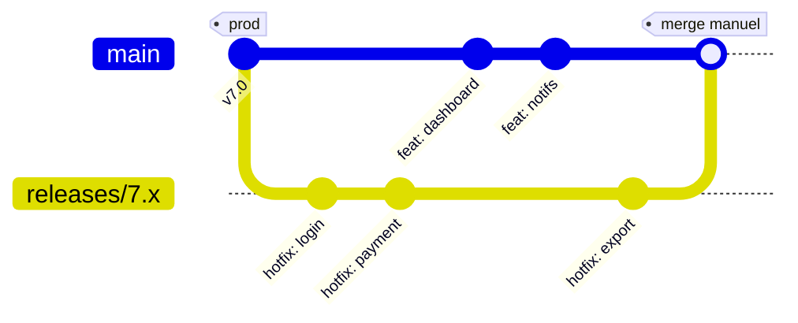
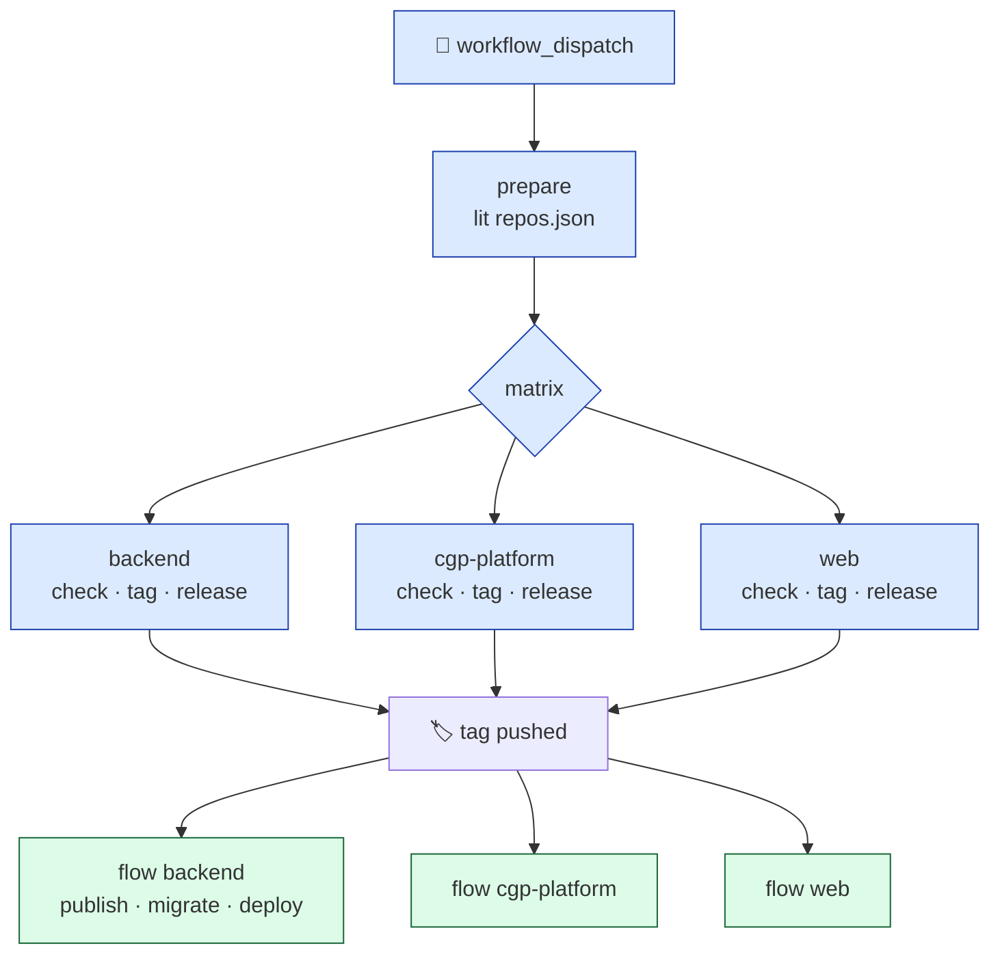
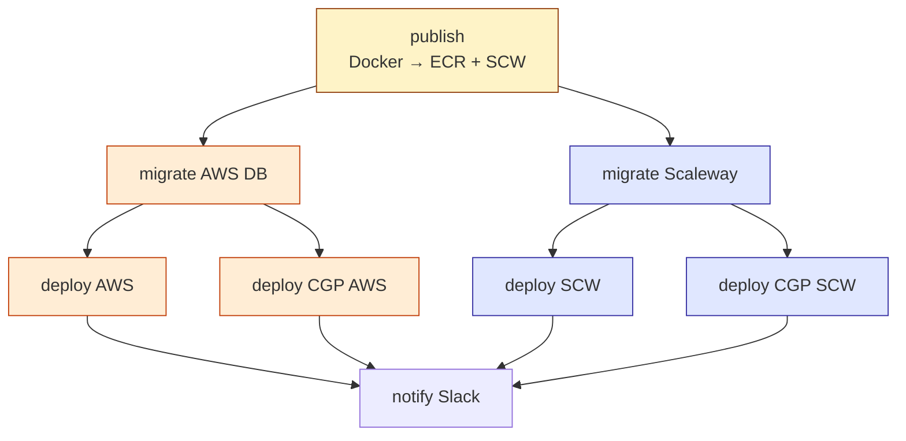

<style>
#slidev-goto-dialog {
  display: none !important;
}
.mermaid {
  text-align: center;
}
.slidev-layout.default h1 {
  font-size: 1.75rem;
  font-weight: 700;
  line-height: 1.25;
  margin-bottom: 0;
}
.slidev-layout.default footer p {
  margin: 0;
}
</style>

---
layout: cover
---

# Automatiser les MEPs

<div class="text-2xl text-gray-400 font-light mt-2">Se simplifier la vie avec Github Actions</div>

<div class="absolute bottom-14 left-16 flex items-center gap-4 text-gray-500">

<span class="font-medium text-gray-700">Axel Mathieu-Le Gall</span> · Senior Fullstack Developer · Wealthcome
</div>

---

<!-- SLIDE 2 : HOOK -->

<div class="h-full flex flex-col justify-center items-center text-center px-20">

<div v-click class="mb-14">
  <p class="text-4xl font-light tracking-tight mb-3">45 minutes pour une mise en prod.</p>
  <p class="text-xl text-gray-500 font-light">3 personnes mobilisées.</p>
</div>

<div v-click>
  <p class="text-4xl font-light tracking-tight mb-3">Aujourd'hui : <span class="font-medium">4 minutes</span>.</p>
  <p class="text-xl text-gray-500 font-light">1 clic et c'est tout</p>
</div>

</div>

<!--
Phase 1 (0-5s) — Silence d'entrée.
Phase 2 (5-12s) — Premier bloc. "45 minutes..." [pause] "3 personnes mobilisées."
Phase 3 (12-20s) — Respiration 2-3s.
Phase 4 (20-28s) — Second bloc. Descend en intensité jusqu'au murmure sur "attend".
Phase 5 (28-30s) — "Je m'appelle Axel, et en 30 minutes je vais vous raconter comment on est passés de l'un à l'autre."
-->

---

# Le workflow qu'on avait hérité



- ❌ **Preprod** = env de test + env de démo
- ❌ **Hotfix** qui ne remontent pas dans `main`
- ❌ Quelqu'un joue les **plombiers Git** à la place des devs

<!--
Oral (1m30) :
- "Chez nous, back et cgp-platform utilisaient releases/X.x pour les hotfix."
- "Principe : bug en prod, on tire une branche depuis la dernière release, on fixe, on déploie."
- "Problème : personne ne remergeait ça dans main."
- "La personne qui orchestrait les préprods devait chaque semaine vérifier les hotfix accumulés, remerger à la main, gérer les conflits."
- "Conflits qu'elle comprenait mal. Devs d'origine en vacances (full remote) : pire."
- "Pas d'env de test : preprod servait aux devs ET aux clients pour les démos."

PÉPITE : "Un workflow qui n'est la responsabilité de personne devient le fardeau de tout le monde."
-->

---

# Les 3 questions qu'on se posait toutes les semaines

<div class="space-y-8 mt-8">

<div v-click class="border-l-4 border-red-400 pl-6">

🔀 **"Est-ce que j'ai bien pris tous les hotfix ?"**

<span class="text-sm text-gray-500">Est-ce que j'ai bien géré les conflits ? Est-ce que je perds un fix qu'un·e collègue a fait il y a 3 jours ?</span>

</div>

<div v-click class="border-l-4 border-amber-400 pl-6">

📢 **"C'est quoi qui part en prod ce soir ?"**

<span class="text-sm text-gray-500">Changelog = liste brute de titres de commits. Pas de nomenclature, pas toujours de ticket. Statuts MàJ à la main.</span>

</div>

<div v-click class="border-l-4 border-blue-400 pl-6">

🕰️ **"Ça a été déployé quand, exactement ?"**

<span class="text-sm text-gray-500">Rythmes de préprod et de prod irréguliers. On déployait "quand on pouvait". Zéro prévisibilité.</span>

</div>

</div>

<!--
Oral (1m30) — intègre le "qui je suis" :
- "3 questions qu'on se posait à chaque MEP."
- (1) Stress du hotfix.
- (2) Communication qu'on envoyait en chinois (titres de commits).
- (3) Rythme : zéro prévisibilité.
- "À ce stade, j'étais un nouvel arrivant. Personne ne considérait ça comme anormal."

PÉPITE : "À force de vivre avec la douleur, on finit par ne plus la voir."
-->

---

# Ce qu'on a remis en place d'abord

<div class="text-gray-500 italic mt-4 mb-10">
L'automatisation n'a pas été la 1ère étape. Il a fallu d'abord réparer les fondations.
</div>

**✅ Un flow Git simple et redevable**

<span class="text-gray-500 text-sm ml-8">GitHub Flow — `main` stable + branches `feat/*`, `fix/*`. Plus de `releases/X.x` orphelines.</span>

<div class="mt-6"></div>

**✅ Des environnements dédiés et étanches**

<span class="text-gray-500 text-sm ml-8">`dev` → `staging` (feature branch) → `preprod` (tests produit) → `prod`</span><br/>
<span class="text-gray-500 text-sm ml-8">`staging` pour les feature branch</span>

<div class="mt-6"></div>

**✅ Une CI qui bloque avant la préprod**

<span class="text-gray-500 text-sm ml-8">Tests, lint, build reproductibles, nomenclature PR</span>

<!--
Oral (30-45s) :
- "Avant d'aller plus loin : ces automatisations supposent des fondations."
- "CI qui marche. Stratégie de branche claire. Infra cloud prête."
- "Sans ces 3, l'automatisation amplifie le chaos."

TRANSITION section 5 :
"Précision importante : pas 'discipline OU automatisation'. Les deux.
Discipline pour les décisions qui nécessitent du jugement. Automatisation pour tout ce qui prend plus de 5 minutes manuelles."
-->

---

# La partie web : 6 repos, 1 équipe

<div class="grid grid-cols-5 gap-1 mt-4">

<div class="border rounded-lg p-2 text-center">
  <div class="text-xl mb-1">🎨</div>
  <div class="font-semibold text-xs">web</div>
  <div class="text-[10px] text-gray-500">Front B2C · React/TS</div>
  <div class="text-[10px] text-green-600 mt-1">🚀 déployé</div>
</div>

<div class="border rounded-lg p-2 text-center">
  <div class="text-xl mb-1">🎨</div>
  <div class="font-semibold text-xs">cgp-platform</div>
  <div class="text-[10px] text-gray-500">Front B2B · React/TS</div>
  <div class="text-[10px] text-green-600 mt-1">🚀 déployé</div>
</div>

<div class="border rounded-lg p-2 text-center">
  <div class="text-xl mb-1">⚙️</div>
  <div class="font-semibold text-xs">backend</div>
  <div class="text-[10px] text-gray-500">API · Nest/TS</div>
  <div class="text-[10px] text-green-600 mt-1">🚀 déployé</div>
</div>

<div class="border rounded-lg p-2 text-center">
  <div class="text-xl mb-1">⚡</div>
  <div class="font-semibold text-xs">aggregated</div>
  <div class="text-[10px] text-gray-500">Nouvelle API · Hono/TS</div>
  <div class="text-[10px] text-green-600 mt-1">🚀 déployé</div>
</div>

<div class="border rounded-lg p-2 text-center">
  <div class="text-xl mb-1">🗄️</div>
  <div class="font-semibold text-xs">shared-aggregations</div>
  <div class="text-[10px] text-gray-500">Migrations · Schémas DB</div>
  <div class="text-[10px] text-green-600 mt-1">🚀 déployé</div>
</div>

</div>

<div class="grid grid-cols-5 gap-1 mt-2 mb-4">

<div class="col-span-3 border border-dashed border-blue-300 rounded-lg p-2 flex items-center gap-2 bg-blue-50">
<span>📦</span>
<span class="font-semibold text-xs">wealthcome-cgp</span>
<span class="text-[10px] text-gray-500">Types partagés</span>
<div class="ml-auto text-[10px] text-blue-600 whitespace-nowrap">↑ web · cgp-platform · backend</div>
</div>

<div class="col-span-2 border border-dashed border-orange-300 rounded-lg p-2 flex items-center gap-2 bg-orange-50">
<span>🗄️</span>
<span class="font-semibold text-xs text-orange-800">shared-aggregations</span>
<div class="ml-auto text-[10px] text-orange-700 whitespace-nowrap">↑ backend · aggregated</div>
</div>

</div>

<div class="text-gray-600 italic text-sm mb-3">Ce qu'on vivait au quotidien :</div>

- 🐌 Déployer une feature cross-app = orchestrer ces repos, à la main, dans le bon ordre
- 🔀 Taguer, release, notifier Slack = 5× le même process, manuellement
- 📋 Savoir ce qui part en prod ce soir = checker 5 GitHub, recopier à la main

<!--
Oral (1m30) :
- "3 apps, 1 équipe."
- "CGP = Conseiller en Gestion de Patrimoine. On travaille dans la fintech."
- "Process de release : 1 à 2 heures par MEP. Plus tenable."
-->

---

# Ce qu'on cherchait à résoudre

<div class="space-y-7 mt-8">

<div class="flex items-start gap-6">
<div class="text-3xl">🎯</div>
<div>

**Un point d'entrée unique**

<span class="text-gray-500">Une équipe ≠ se disperser entre 3 repos. Où cliquer, où déclencher, où regarder ?</span>

</div>
</div>

<div class="flex items-start gap-6">
<div class="text-3xl">🔗</div>
<div>

**De la logique partagée**

<span class="text-gray-500">Tagging, release, notifs : 3× la même chose → une seule implémentation, réutilisable.</span>

</div>
</div>

<div class="flex items-start gap-6">
<div class="text-3xl">📊</div>
<div>

**Une vue d'ensemble**

<span class="text-gray-500">Ce qui part en prod ce soir, dans toutes les apps → agrégation, pas dispersion.</span>

</div>
</div>

</div>

<!--
Oral (1m30) :
- "On n'a pas cherché à changer notre architecture — elle nous convenait."
- "On cherchait à l'orchestrer intelligemment."

Élimine le débat monorepo vs multi-repos.
-->

::footer::

_Pas de refonte d'architecture. Juste une couche d'orchestration._

---

# L'inspiration : le package `meta`

<div class="text-sm text-gray-500 mb-6">
Créé par @mateodelnorte · Dernière MAJ : 2020
</div>

> "Why choose many repos or a monolithic repo, when you can have both with a meta repo?"

<div class="grid grid-cols-2 gap-10 mt-10">

<div>

**L'idée qu'on a gardée**

- 📄 Un descripteur listant tous les repos
- 🎯 Un repo "parent" qui orchestre
- ⚡ Des commandes qui s'appliquent partout

</div>

<div>

**Pourquoi notre propre implémentation**

- Package non maintenu depuis 5 ans
- On voulait GitHub Actions + pnpm workspace
- Besoins spécifiques : Notion, Slack, tags RC/prod

</div>

</div>

<!--
Oral (1m30) :
- "Je tenais à citer meta. C'est cette lecture qui nous a donné le cadre mental."
- "On n'a pas inventé la roue, on l'a réimplémentée."

⚠️ Q&A anticipée : "meta n'est plus maintenu" → "exactement, c'est pourquoi je release mon propre pkg, dans la dernière partie du talk."
-->

::footer::

_pnpm workspace + GitHub Actions + scripts bash = même philosophie, stack 2026_

---

# `wealthcome-meta` : la structure

```text {all|3-6|8-9|11-15|17-21|22|all}
wealthcome-meta/
│
├── apps/                       # repos clonés (gitignored)
│   ├── backend/
│   ├── cgp-platform/
│   └── web/
│
├── packages/                   # logique métier partagée
│   └── generate-changelog/     # (TypeScript)
│
├── scripts/                    # orchestration locale
│   ├── sync-repos.sh
│   ├── add-repo.sh
│   └── generate-*-tag.sh
│
├── .github/                    # CI/CD partagée
│   ├── actions/
│   └── workflows/
│
├── repos.json                  # 👈 le descripteur
└── pnpm-workspace.yaml
```

<!--
Oral (2m) — révélation progressive {all|3-6|...} :
- (1) L'arborescence.
- (2) apps/ : repos clonés, gitignored.
- (3) packages/ : logique métier, ici générateur de changelog TS.
- (4) scripts/ : bash pur (sync-repos, add-repo, tags).
- (5) .github/ : CI/CD partagée.
- (6) repos.json : le descripteur (slide suivante).

PÉPITE : "Un petit repo, ~2000 lignes. pnpm workspace classique. Rien de magique."
-->

---

# Le dev workflow en 2 étapes

<div class="grid grid-cols-2 gap-8 mt-6">

<div>

<div class="text-sm uppercase tracking-wider text-gray-500 mb-3">1. Le descripteur</div>

```json
[
  {
    "name": "backend",
    "url": "git@github.com:..."
  },
  {
    "name": "cgp-platform",
    "url": "git@github.com:..."
  },
  {
    "name": "web",
    "url": "git@github.com:..."
  }
]
```

<div class="text-xs text-gray-500 mt-2">repos.json</div>

</div>

<div>

<div class="text-sm uppercase tracking-wider text-gray-500 mb-3">2. Onboarding en 1 commande</div>

```bash
$ git clone .../wealthcome-meta
$ cd wealthcome-meta
$ pnpm install
$ pnpm sync

✓ Cloned backend
✓ Cloned cgp-platform
✓ Cloned web
```

<div class="text-xs text-gray-500 mt-2">terminal</div>

</div>

</div>

<!--
Oral (2m) :
- "repos.json = source de vérité, liste des projets."
- "pnpm sync clone ou pull tous les repos dans apps/."
- "Onboarding nouveau dev : clone du meta, install, sync. 2 minutes."

TRANSITION : "Voilà l'architecture. Un repo, un descripteur, des scripts. La magie est dans la CI/CD."
-->

::footer::

<span class="text-gray-500">Avant :</span> 1 journée d'onboarding · <span class="text-gray-500">Après :</span> <span class="font-semibold">2 minutes</span>

---

# Un pipeline en 2 niveaux

<div class="text-sm text-gray-500 mb-4">La décision architecturale clé.</div>



<div class="text-center text-xs text-gray-600 mt-2">
Niveau 1 : wealthcome-meta orchestre · Niveau 2 : chaque repo déploie
</div>

<!--
Oral (1m30) — LA slide de référence :
- "Décision architecturale clé."
- "Le meta ne connaît PAS les détails de déploiement. Il crée des tags."
- "Chaque repo a son propre flow qui réagit."
- "Souveraineté de déploiement."
- "Back : 4 jobs (AWS + SCW, app + CGP). Front : 1. Le meta ne doit pas savoir ça."
- "Le couplage se fait par le tag — interface la plus universelle en Git."
-->

---

# Guérir la douleur du hotfix

<div class="bg-red-50 border-l-4 border-red-400 p-3 mb-6 italic text-gray-700">
🔀 <strong>"Est-ce que j'ai bien pris tous les hotfix ?"</strong>
</div>

<div class="grid grid-cols-2 gap-8">

<div>

<div class="text-sm font-semibold uppercase tracking-wider text-gray-600 mb-3">
1 · Vérifier la synchronisation
</div>

```yaml
- name: Check hotfix sync
  run: |
    missing=$(git log main..releases/X.x \
              --oneline)
    if [ -n "$missing" ]; then
      echo "::error::Hotfix non remontés"
      exit 1
    fi
```

</div>

<div>

<div class="text-sm font-semibold uppercase tracking-wider text-gray-600 mb-3">
2 · Validation humaine
</div>

- Le meta crée la release en **DRAFT**
- Un humain relit, valide, publie
- Le push du tag déclenche le déploiement

<div class="mt-5 bg-green-50 border-l-4 border-green-400 p-3 text-sm italic text-gray-700">
→ 2 filets de sécurité avant toute MEP
</div>

</div>

</div>

<!--
Oral (1m30) :
- "Première douleur : hotfix perdu."
- "Étape de vérif : si un commit existe sur releases/X.x mais pas sur main, pipeline s'arrête."
- "2ème filet : release draft. Un humain clique 'Publish'."
- "L'automatisation n'enlève pas le jugement, elle l'éclaire."
-->

---

# Guérir les rythmes irréguliers

<div class="bg-blue-50 border-l-4 border-blue-400 p-3 mb-6 italic text-gray-700">
🕰️ <strong>"Ça a été déployé quand, exactement ?"</strong>
</div>

<div class="grid grid-cols-2 gap-8">

<div>

<div class="text-sm font-semibold uppercase tracking-wider text-gray-600 mb-3">
Préprod — tous les matins
</div>

```yaml
on:
  schedule:
    - cron: '0 7 * * 1-5'
    #        ↑ 9h, jours ouvrés
```

<div class="text-sm text-gray-600 mt-4">
Ce qui a été mergé hier est testable en arrivant au bureau.
</div>

</div>

<div>

<div class="text-sm font-semibold uppercase tracking-wider text-gray-600 mb-3">
Prod — 2× par semaine, à la demande
</div>

```yaml
on:
  workflow_dispatch:
    inputs:
      repos:
        description: 'all OR csv'
        default: 'all'
```

<div class="text-sm text-gray-600 mt-4">
Mardi et jeudi. L'équipe et le produit s'y préparent.
</div>

</div>

</div>

<!--
Oral (1m30) :
- "2e douleur : rythme. 2 rythmes distincts."
- "Préprod cron chaque matin 9h. Devs savent que ce qu'ils ont mergé la veille est testable."
- "Prod 2×/semaine à la main, mardi/jeudi. On garde le contrôle du moment."
- "Produit sait quand préparer démos. Support sait. On n'est plus dans la réactivité."

PÉPITE : "Un rythme régulier, c'est un cadeau qu'on fait à tout le monde — y compris à soi-même."
-->

::footer::

_Fini le "quand on pourra". Tout le monde sait quand._

---

# Guérir les communications

<div class="bg-amber-50 border-l-4 border-amber-400 p-2 mb-3 italic text-gray-700 text-sm">
📢 <strong>"C'est quoi qui part en prod ce soir ?"</strong>
</div>

<div class="space-y-2 text-sm">

**1 · Nomenclature forcée à la PR**

```yaml
uses: wealthcome-SAS/actions/check-pr-title@stable
# Pattern imposé : feat(module): description [TICKET-42]
```

<span class="text-gray-500 text-xs">→ Pas de ticket = pas de merge</span>

**2 · Changelog enrichi, pas brut**

```text
packages/generate-changelog/
├── github.ts     ← fetch PRs
├── notion.ts     ← enrichit avec les titres tickets
└── slack.ts      ← formate + @tag les owners
```

<span class="text-gray-500 text-xs">→ Produit lit "Ajout export PDF [AUTH-42]", pas "fix: update flow (PR #312)"</span>

**3 · Tags @personnes + MAJ Notion automatique**

<span class="text-gray-500 text-xs">Ticket mentionné → owner @tag dans Slack · statut Notion passe à "Déployé" · plus de DM "c'est parti ?"</span>

</div>

<!--
Oral (1m30) :
- "Douleur la plus vicieuse : communications."
- "Avant : changelogs = commits bruts. Produit lit en chinois."
- "3 niveaux : nomenclature forcée, changelog enrichi via Notion, tags @owners Slack."
- "Plus de DM 'c'est parti ?'. Ils savent en temps réel."

PÉPITE : "LA slide où l'automatisation paie le plus. Parce qu'elle fait gagner du temps à des gens qui ne savent même pas qu'on l'a automatisé. Produit, support, clients : ils bénéficient d'un système qu'ils ne voient pas. Meilleure définition de la qualité."
-->

---

# Le dry run — l'option qui donne confiance

```yaml
workflow_dispatch:
  inputs:
    dry_run:
      description: 'Simulation sans effet de bord'
      type: boolean
      default: false
```

<div class="grid grid-cols-2 gap-8 mt-8 text-sm">

<div>

<div class="font-semibold uppercase tracking-wider text-gray-600 text-xs mb-3">Ce que ça fait</div>

- ✅ Simule : check_diff, calcul du tag, changelog
- ✅ Affiche dans les logs ce qui serait fait
- ❌ Ne crée pas de tag
- ❌ Ne poste rien sur Slack
- ❌ Ne met rien à jour dans Notion

</div>

<div>

<div class="font-semibold uppercase tracking-wider text-gray-600 text-xs mb-3">Quand on l'utilise</div>

- Avant une release sensible (vendredi)
- Vérifier la nomenclature des PRs
- Former un nouvel arrivant sans risque
- Débugger quand on a peur de casser

</div>

</div>

<!--
Oral (1m) :
- "Option ajoutée après 2-3 mois, pas au début."
- "Mode simulation. Calcule ce qui se passerait, l'affiche, ne touche à rien."
- "Case qu'on coche le vendredi, systématiquement."
- "Aussi utile pour onboarder un nouveau sans risque."

PÉPITE : "La meilleure automatisation, c'est celle qu'on ose lancer. Pas celle qu'on évite d'approcher."
-->

::footer::

_💡 La meilleure automatisation, c'est celle qu'on ose lancer._

---

# Le flow backend : 2 clouds, 1 tag

<div class="text-xs text-gray-500 mb-2 text-center">Déclencheur : <code>on: push: tags: [v*.*.*-rc.*]</code></div>

<div class="flex justify-center">



</div>

<div class="text-xs text-gray-500 text-center mt-2">
<strong>3 choses à retenir :</strong> pattern de tag · DAG des <code>needs:</code> · <code>concurrency:</code> groups
</div>

<!--
Oral (2m) :
- "DAG de préprod backend. Un tag RC le déclenche."
- "2 clouds parallèles : AWS + Scaleway. Clients sur chacun."
- "4 déploiements : app et CGP, sur les 2 clouds."
- "3 choses à retenir :"
- "1. Pattern de tag : v*.*.*-rc.* pour préprod, v*.*.* pour prod."
- "2. DAG des needs: publish → migrate → deploy → notify. Jamais de parallélisme hasardeux."
- "3. concurrency: groups. Si 2 MEPs en 10s, GitHub n'en fait qu'une. Sans ça : déploiements qui se marchent dessus."
-->

---

# Runners Kube + actions partagées

<div class="grid grid-cols-2 gap-10 mt-6">

<div>

**🖥️ Runners self-hosted (EKS)**

Pourquoi :
- Accès réseau direct aux clusters
- Caches partagés entre jobs
- Coût (pour un volume élevé)

```yaml
migrate:
  uses: ./.github/workflows/migrate.yml
  with:
    runner: preproduction-services
    environment: preproduction-aws
```

</div>

<div>

**📦 Actions partagées**

Repo `wealthcome-SAS/actions` :

```yaml
- uses: wealthcome-SAS/actions/send-slack-message@stable
- uses: wealthcome-SAS/actions/check-pr-title@stable
- uses: wealthcome-SAS/actions/.github/workflows/publish.yml@stable
```

<div class="mt-4 text-sm text-gray-600">

→ DRY à travers tous nos repos

→ Une correction = tous les repos l'ont

</div>

</div>

</div>

<!--
Oral (1m30) :
- "Runners self-hosted sur EKS. Mêmes clusters qu'on déploie → zéro config réseau. Caches Docker partagés : build qui prenait 6min → 90s."
- "Repo wealthcome-SAS/actions avec nos composite actions : send-slack-message, check-pr-title, publish (ECR)..."
- "Quand on les améliore, tous nos repos en bénéficient. DRY au niveau CI/CD."
-->

---

# Le pipeline en action

<div class="h-full flex flex-col items-center justify-center gap-10 -mt-6">

<div class="text-2xl font-light text-gray-700 italic">
Et si je vous montrais ?
</div>

<a href="https://github.com/wealthcome-SAS/wealthcome-meta/actions/workflows/prerelease.yml" target="_blank" class="flex items-center justify-center w-24 h-24 rounded-full bg-gray-900 hover:bg-gray-700 transition-colors shadow-lg text-white text-4xl pl-2 no-underline">▶</a>

<div class="text-sm text-gray-400">
github.com/wealthcome-SAS/wealthcome-meta · Actions · prerelease.yml
</div>

</div>

<!--
Oral :
- Cliquer sur le bouton pour ouvrir le workflow GitHub Actions en live.
- Déclencher une run en direct si possible, sinon montrer une run récente.
-->

::footer::

_Du clic "Run workflow" au "✅ en prod" : ~4-5 minutes_

---

# Le vrai défi : embarquer les leads

<div class="mt-4 space-y-3">

<div class="bg-gray-50 border-l-4 border-gray-300 p-3">

<div class="uppercase tracking-wider text-xs text-gray-500 mb-1">Décor</div>

Nouvel arrivant. Une équipe en place, 3 ans de process installés. J'arrive avec ma solution d'automatisation.

</div>

<div class="bg-red-50 border-l-4 border-red-400 p-3">

<div class="uppercase tracking-wider text-xs text-red-500 mb-1">Drame</div>

Au démarrage : des bugs, des comportements inattendus. Un tag qui pointe trop loin, une release qui part avec des commits non prêts.<br/>
→ Les leads se braquent. *"On te l'avait dit. On a toujours fait comme ça."*

</div>

<div class="bg-amber-50 border-l-4 border-amber-400 p-3">

<div class="uppercase tracking-wider text-xs text-amber-700 mb-1">Le vrai enjeu</div>

La technique, on l'a corrigée en quelques jours.<br/>
**Regagner la confiance des leads a pris des mois.**

</div>

</div>

<!--
Oral (1m30) :
- "La plus grosse galère, ce n'était pas la technique."
- "C'était d'embarquer les leads."
- "Au démarrage, l'automatisation a eu ses bugs — un tag qui pointe trop loin, une release qui embarque des commits pas prêts."
- "Et chaque incident, même mineur, a renforcé les sceptiques : 'on te l'avait dit'."
- "Le bug technique, on le patche en 2 jours."
- "La confiance perdue, ça prend des mois à reconstruire."
- [Tone : 'j'ai mal amené le sujet au début' plutôt que 'ils ne voulaient rien entendre']

TRANSITION vers 7.3 :
"Voilà comment on a fait."
-->

---

# Le vrai coût : un process isolé

<div class="text-gray-500 italic text-sm mb-2">
Le bug technique était gérable. Le vrai problème était ailleurs.
</div>

<div class="text-center text-lg font-medium uppercase tracking-wider text-gray-700 mb-3">
Comment on a reconstruit la confiance
</div>

<div class="space-y-3">

<div class="flex items-center gap-4 bg-blue-50 p-3 rounded-lg">
<div class="text-3xl shrink-0">📢</div>
<div>

**1 · Présentations aux équipes tech + produit**

<span class="text-gray-600 text-sm">Rendre l'opaque visible</span>

</div>
</div>

<div class="flex items-center gap-4 bg-blue-50 p-3 rounded-lg">
<div class="text-3xl shrink-0">🔄</div>
<div>

**2 · Réunions d'itération avec les leads**

<span class="text-gray-600 text-sm">Co-construire, pas imposer</span>

</div>
</div>

<div class="flex items-center gap-4 bg-blue-50 p-3 rounded-lg">
<div class="text-3xl shrink-0">🎓</div>
<div>

**3 · Rôle tournant sur le process**

<span class="text-gray-600 text-sm">Chacun se fait son propre avis, devient ambassadeur</span>

</div>
</div>

</div>

<!--
Oral (1m30-1m45) :
- "Bug technique gérable. Vrai problème : personne ne comprenait le process."
- "J'avais construit un outil — pas un savoir partagé."
- [Détailler les 3 actions]
- "Rôle tournant : ma plus grande fierté. Chaque lead porte le process à tour de rôle. Se forge son propre avis, devient ambassadeur."

PUNCHLINE (oral, pas sur slide) :
"Automatiser un process, ce n'est pas le déléguer à une machine. C'est le partager avec l'équipe."
-->

---
layout: center
class: text-center
title: Ce qu'on a retenu
---

<div class="space-y-10">

<div class="text-sm uppercase tracking-wider text-gray-500">Ce qu'on a retenu</div>

<div class="text-4xl font-light">
Pas discipline <span class="italic text-gray-400">ou</span> automatisation.
</div>

<div class="text-2xl font-light space-y-2">

Discipline pour **décider**.

Automatisation pour **exécuter**.

</div>

<div class="text-xl text-gray-600 italic mt-10">
Tout ce qui dépasse 5 minutes de répétitif<br/>
mérite d'être automatisé.
</div>

</div>

<!--
Oral (30-45s) — slide-respiration :
- "Avant de parler des résultats, une phrase qu'on a retenue."
- [Lire calmement]
- "Ce n'est pas un slogan. C'est une règle qu'on s'impose."
-->

---

# 1 mois plus tard

<div class="grid grid-cols-3 gap-6 mt-10">

<div class="text-center">

<div class="text-5xl font-light tracking-tight">
<span class="text-gray-400">6</span> → 7
</div>

<div class="text-sm uppercase tracking-wider text-gray-500 mt-3">MEPs prod / semaine</div>

</div>

<div class="text-center">

<div class="text-5xl font-light tracking-tight">
<span class="text-gray-400">45m</span> → 4m
</div>

<div class="text-sm uppercase tracking-wider text-gray-500 mt-3">Durée d'une MEP</div>

</div>

<div class="text-center">

<div class="text-5xl font-light tracking-tight">
<span class="text-gray-400">3</span> → 1
</div>

<div class="text-sm uppercase tracking-wider text-gray-500 mt-3">Personnes mobilisées</div>

</div>

</div>

<div class="mt-16 border rounded-lg p-6 text-center text-gray-700 space-y-2">

~**14 heures** d'équipe gagnées par semaine

Pipeline prod <span class="font-semibold">18min → 12min</span> <span class="text-gray-500">(-33%)</span> · web <span class="font-semibold">33min → 17min</span> <span class="text-gray-500">(-48%)</span>

Préprod **×1,6** — 15 → 25 déploiements/semaine

**0 hotfix perdu** depuis le déploiement

</div>

<!--
Oral (1m) :
- "3 chiffres. Volume, vitesse, humain."
- "Fréquence prod quasi-identique — 6 → 7/semaine. La différence, c'est ce que ça coûte : 6 MEPs × 45min × 3 personnes = 850 person-minutes avant. Aujourd'hui 7 × 4min × 1 = 28. Soit ~14 heures d'équipe rendues chaque semaine."
- "45 min → 4. 3 personnes → 1. Et les pipelines eux-mêmes sont plus rapides : prod 18min → 12min en moyenne, web de 33min à 17min."
- "La préprod, elle, a doublé. 15 → 25 déploiements/semaine. Ça veut dire que l'équipe valide plus souvent, plus tôt."
- "Et 0 hotfix perdu depuis qu'on a lancé."

PÉPITE : "Les personnes les plus sceptiques au début sont celles qui s'inquiètent aujourd'hui si le pipeline a 5 min de retard."
-->

---

# Ce que l'équipe en dit

<div class="space-y-3 mt-4">

<div class="border rounded-lg p-3 flex gap-3 items-start">
<div class="w-10 h-10 rounded-full bg-gray-200 flex items-center justify-center text-xs text-gray-500 shrink-0">
photo
</div>
<div class="flex-1">

**Solène Oruezabal** — <span class="text-sm text-gray-500">Équipe produit</span>

<span class="text-sm italic">"Depuis le changement, c'est clairement la charge mentale qui a changé. Je sais que c'est automatique — plus besoin de relancer 25 fois les équipes dans la journée."</span>

</div>
</div>

<div class="border rounded-lg p-3 flex gap-3 items-start">
<div class="w-10 h-10 rounded-full bg-gray-200 flex items-center justify-center text-xs text-gray-500 shrink-0">
photo
</div>
<div class="flex-1">

**Rémi Poulenard** — <span class="text-sm text-gray-500">Developer · Wealthcome</span>

<span class="text-sm text-gray-400 italic">"La mise en place de notre nouveau processus d'automatisation a profondément transformé notre manière de travailler. Les déploiements, désormais simplifiés, génèrent moins de conflits et mobilisent moins de temps de gestion. Résultat : une équipe plus confiante et une vélocité de livraison nettement améliorée."</span>

</div>
</div>

<div class="border rounded-lg p-3 flex gap-3 items-start">
<div class="w-10 h-10 rounded-full bg-gray-200 flex items-center justify-center text-xs text-gray-500 shrink-0">
photo
</div>
<div class="flex-1">

**{Axel Mathieu-Le Gall}** — <span class="text-sm text-gray-500">Lead Tech</span>

<span class="text-sm text-gray-400 italic">[verbatim à collecter]</span>

</div>
</div>

</div>

<!--
Oral (1m) :
- "Les chiffres, c'est une chose. Ce qui me rend fier, c'est d'entendre l'équipe."
- [Lire Solène]
- "Elle parle de charge mentale. Pas de vitesse, pas de tech. De charge mentale. Relançait 25 fois par jour, maintenant elle n'y pense plus. Le vrai gain : dans le cerveau des gens qui travaillent avec nous."
- [Lire les 2 autres]

PÉPITE : "L'automatisation réussie, c'est celle qui rend le travail des autres plus léger."

⚠️ TODO : 2 verbatims manquants
-->

---

# Je release : `@{handle}/meta`

<div class="grid grid-cols-3 gap-6 mt-12">

<div class="border rounded-lg p-6">

<div class="text-3xl mb-2">🎯</div>

**Opinionated**

<span class="text-sm text-gray-600">pnpm workspaces + GitHub Actions + release orchestrées</span>

</div>

<div class="border rounded-lg p-6">

<div class="text-3xl mb-2">🚀</div>

**Out-of-the-box**

<span class="text-sm text-gray-600">Workflows de release, tagging RC/prod, notifs Slack</span>

</div>

<div class="border rounded-lg p-6">

<div class="text-3xl mb-2">🔌</div>

**Extensible**

<span class="text-sm text-gray-600">Hooks pour brancher Notion, Linear, Jira ou custom</span>

</div>

</div>

<!--
Oral (1m) :
- "30 minutes de récit → abstraction. Donc je release le pkg qui en extrait le cœur."
- "Opinionated, out-of-the-box, extensible."
- "Honnêteté : alpha aujourd'hui. Version stable en interne, extraction en OSS prend du temps. Stable prévu {date}."
- "Repo ouvert aux PRs et issues dès aujourd'hui."

PÉPITE : "Le nom, hommage à Mateo del Norte. Sans son travail il y a 10 ans, on aurait tous réinventé la roue 10 fois. Cette fois, on la fait tourner."

⚠️ TODO : remplacer {handle} et {date}
-->

::footer::

<div class="flex items-center justify-center gap-8">
<code class="text-xs bg-gray-100 px-2 py-1 rounded">npm i -D @{handle}/meta</code>
<span class="text-gray-500">🔗 github.com/{handle}/meta</span>
<span class="text-xs text-gray-400">🧪 alpha · stable prévu {date}</span>
</div>

---

# Un repo modèle pour commencer

<div class="text-sm text-gray-500 mb-8">
🔗 github.com/{handle}/meta-examples
</div>

<div class="grid grid-cols-2 gap-6">

<div class="border rounded-lg p-6">

<div class="text-4xl mb-3">📂</div>

**monorepo-example**

- Turborepo
- React (front)
- Fastify (back)
- Contrats partagés
- Déploiement Vercel + Fly.io

</div>

<div class="border rounded-lg p-6 bg-blue-50">

<div class="text-4xl mb-3">📂</div>

**metarepo-example**

- pnpm workspaces
- `@{handle}/meta` (releases)
- 3 apps clonées via repos.json

<span class="text-gray-500 italic text-sm">← notre approche</span>

</div>

</div>

<div class="mt-8 text-sm text-gray-600">

→ 2 setups prêts à cloner · CI/CD fonctionnelle · Documentation étape par étape

</div>

<!--
Oral (1m) :
- "Pkg sans exemple = API cryptique. Repo modèle avec 2 setups complets."
- "1. Monorepo moderne : Turborepo, React, Fastify. Approche populaire."
- "2. Exactement ce qu'on a : pnpm workspaces + meta qui orchestre 3 apps."

PÉPITE : "Pas un repo figé. Repo maintenu avec issues ouvertes. Vous utilisez Nx + Kubernetes bare-metal ? Ouvrez une issue, ajoutons un exemple."
-->

::footer::

_💡 Le code du talk, littéralement._

---
layout: center
class: text-center
---

# Merci

<div class="grid grid-cols-2 gap-12 max-w-3xl mx-auto items-center mt-12">

<div class="flex flex-col items-center">


<div class="mt-4 text-base text-gray-600 text-center w-56">
↑ Ton retour sur ce talk (2 min)
</div>

</div>

<div class="text-left">

<div class="flex items-center gap-5 mb-4">

<div>
<div class="text-xl font-semibold leading-snug">Axel Mathieu-Le Gall</div>
<div class="text-sm text-gray-500 mt-1">Senior Fullstack Developer · Wealthcome</div>
</div>
</div>

<div class="pt-8 space-y-3 text-lg">

💼 https://linkedin.com/in/axel-mathieu-le-gall-361b1510a

💻 https://github.com/AxelMth

</div>

</div>

</div>

<!--
Slide persistante pendant toute la Q&A.

Oral :
- "Voilà. Grand merci à [quelqu'un], à l'équipe Wealthcome, à vous."
- "Cette slide reste. Le QR : feedback en 2 minutes."
- "Vos questions."

PÉPITE Q&A : "Celles auxquelles je ne sais pas répondre, je vous dis 'je ne sais pas' — on en discute après."

⚠️ TODO : {Prénom Nom}, {handle}, qr-feedback.svg
-->
